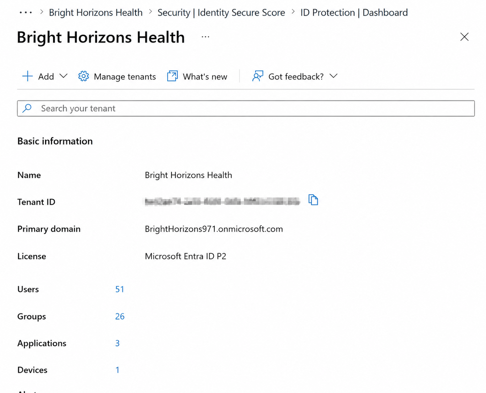
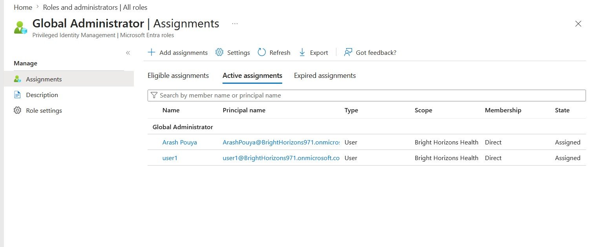
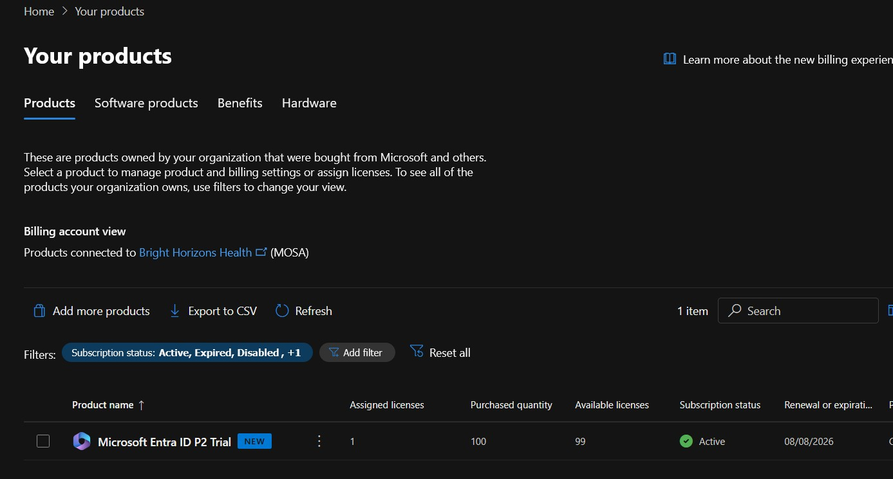
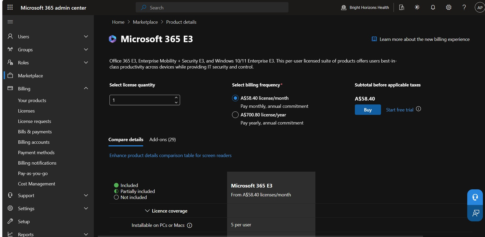
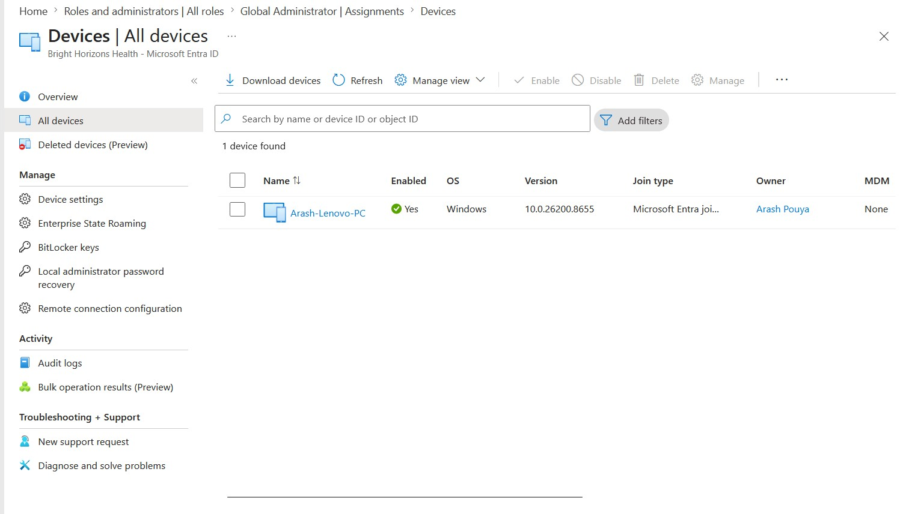
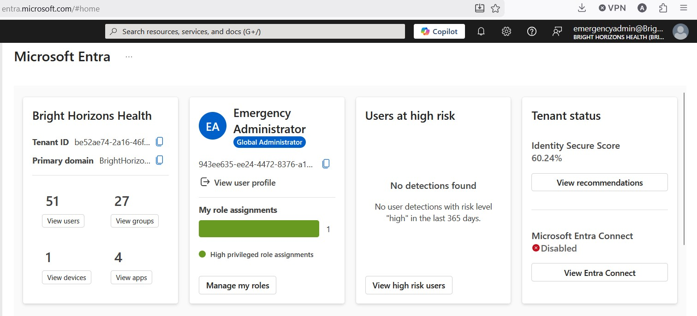

# Project 00 – Intune Readiness Assessment & Tenant Planning

## Overview

Before deploying Microsoft Intune into a production environment, it is essential to understand the existing Microsoft 365 tenant, assess technical readiness, identify business requirements, and establish an implementation strategy.

In this project, I performed a structured readiness assessment of the **Bright Horizons Health** Microsoft 365 environment and developed the planning documentation required to support a successful Microsoft Intune implementation.

This project establishes the technical and operational foundation for all subsequent projects within this repository.

---

## Business Scenario

Bright Horizons Health is a fictional healthcare organisation used throughout this homelab to simulate a realistic small-to-medium business environment.

The organisation already has an established Microsoft Entra ID tenant, users, Microsoft 365 Groups, Security Groups and Microsoft 365 services in use. Before introducing Microsoft Intune, a structured assessment was undertaken to understand the current environment, identify implementation requirements and define a deployment strategy that minimises risk while supporting future growth.

---

## Learning Objectives

The objectives of this project were to:

- Assess the current Microsoft Entra ID environment.
- Review administrative roles and tenant configuration.
- Assess device readiness for Microsoft Intune.
- Evaluate Microsoft licensing requirements.
- Develop an implementation roadmap.
- Produce operational documentation to support future projects.
- Establish governance standards, naming conventions and deployment principles.

---

## Technologies Used

- Microsoft Entra ID
- Microsoft Intune
- Microsoft 365 Admin Center
- Microsoft 365 E3 Trial
- Windows 11
- Microsoft Learn
- Microsoft Documentation

---

## Lab Environment

This project uses an existing Microsoft 365 tenant created during the Microsoft Entra ID Homelab.

Environment components include:

- Microsoft Entra ID tenant
- Existing users and groups
- Administrative accounts
- Microsoft 365 licensing
- Entra joined Windows devices
- Existing enterprise applications
- Bright Horizons Health organisational structure

---

## Project Deliverables

This project produced the following planning artefacts:

- Microsoft Intune Implementation Readiness Assessment
- Microsoft Intune Learning Lab Operational Blueprint
- Environment baseline
- Deployment strategy
- Governance decisions
- Naming standards
- Microsoft Intune implementation roadmap

These documents provide the reference material for all remaining projects within this repository.

---

## Key Activities

During this project I completed the following activities:

- Reviewed the existing Microsoft Entra ID tenant.
- Assessed administrative accounts and privileged access.
- Reviewed existing users, groups and organisational structure.
- Evaluated Microsoft 365 licensing options for Intune.
- Reviewed existing Entra joined devices.
- Assessed enterprise applications currently integrated with Microsoft Entra ID.
- Documented implementation assumptions and design decisions.
- Developed the implementation roadmap for Projects 01–09.

---

## Project Figures

### Figure 1 – Microsoft Entra Tenant Baseline

---

### Figure 2 – Administrative Accounts Baseline

---

### Figure 3 – Licensing Baseline

---

### Figure 4 – Microsoft 365 E3 Trial Availability

---

### Figure 5 – Existing Entra Joined Devices

---

### Figure 6 – Emergency Administrator Validation

---

## Skills Demonstrated

This project demonstrates practical experience in:

- Environment assessment
- Microsoft Entra ID administration
- Microsoft 365 tenant analysis
- Microsoft licensing evaluation
- Microsoft Intune implementation planning
- Technical documentation
- Governance planning
- Solution design
- Deployment planning

---

## Lessons Learned

This project reinforced the importance of completing a structured assessment before implementing new technologies.

Rather than immediately enrolling devices or deploying policies, understanding the existing environment allows implementation decisions to be based on business requirements rather than assumptions. Producing planning documentation at the beginning of the project also improves consistency, reduces implementation risk and provides a reference for future administration.

---

## Documents

The following documents were produced during this project:

- Microsoft Intune Implementation Readiness Assessment *(coming soon)*
- Microsoft Intune Learning Lab Operational Blueprint *(coming soon)*

---

## Next Project

➡ **Project 01 – Intune Foundations & Administration**

The next project establishes the Microsoft Intune administrative environment by reviewing the Intune portal, configuring the initial administration settings and becoming familiar with the core management capabilities that will be used throughout the remainder of the lab.

---

**Repository:** Microsoft Intune Homelab

**Project Status:** ✅ Completed
