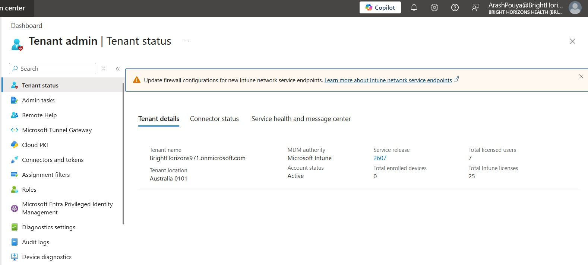
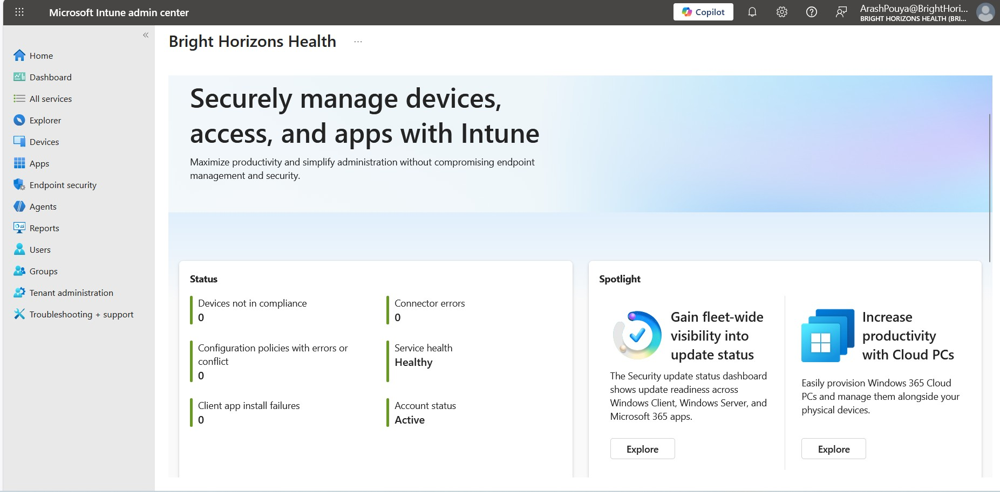
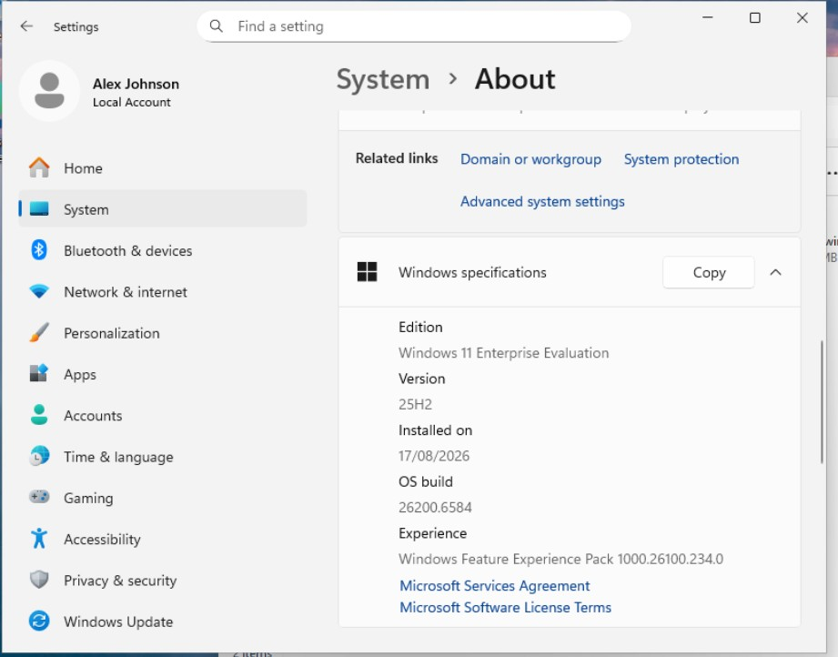

# Project 01 – Intune Foundations & Administration

## Overview

This project established the core Microsoft Intune administrative foundation for the **Bright Horizons Health** homelab and prepared the first Windows 11 pilot device for use in subsequent Intune projects.

The work went beyond simply enabling Intune. It included reviewing the tenant, validating licensing, configuring Microsoft Intune MDM user scope, establishing a pilot administration model, exploring Intune role-based access control (RBAC), and preparing a dedicated Windows 11 virtual machine for Microsoft Entra ID and Intune management.

A significant part of the project also became a practical troubleshooting exercise. An initial enrolment attempt did not behave as expected, which led to investigation of user licensing, MDM enrolment scope, Microsoft Entra device state, Windows work/school connection methods and local Windows diagnostics.

The project concluded with a successfully Microsoft Entra joined and Intune-managed Windows 11 pilot device, together with a tested least-privilege Intune administrative account.

---

## Project Objectives

The objectives of this project were to:

- Establish the foundational Microsoft Intune administrative environment
- Review the existing Microsoft 365 and Microsoft Entra tenant from an Intune perspective
- Validate appropriate Microsoft Intune licensing
- Configure automatic MDM enrolment scope
- Establish an initial pilot user and device model
- Explore Intune administrative roles and least-privilege administration
- Understand the purpose of admin groups, scope groups and scope tags
- Create and test a dedicated Intune administrative account
- Prepare a Windows 11 Enterprise pilot virtual machine
- Join the pilot device to Microsoft Entra ID
- Automatically enrol the pilot device into Microsoft Intune
- Validate device identity and management state
- Perform practical troubleshooting when the initial enrolment process did not work as expected
- Establish a clean foundation for the remaining Intune homelab projects

---

## Lab Environment

The project was performed within the fictional **Bright Horizons Health** Microsoft 365 environment.

### Cloud Environment

- Microsoft Entra ID
- Microsoft Intune
- Microsoft 365
- Microsoft 365 E3 trial licensing
- Enterprise-style users and security groups

### Virtualisation Environment

The Windows pilot endpoint runs within my existing Proxmox homelab.

### Pilot Device

| Property | Value |
|---|---|
| Device name | `WIN11-IT-PILOT` |
| Operating system | Windows 11 Enterprise |
| Platform | Proxmox Virtual Environment |
| Intended purpose | Intune pilot and testing endpoint |
| Identity state at completion | Microsoft Entra joined |
| MDM platform | Microsoft Intune |
| Ownership | Corporate |
| Management state | Managed |

The device was deliberately prepared as a reusable pilot endpoint for later projects involving configuration profiles, compliance policies, application deployment, endpoint security, Windows Update management and troubleshooting.

---

## 1. Reviewing the Existing Intune Environment

Before making configuration changes, I reviewed the existing tenant and Intune environment.

This included checking:

- Microsoft Intune tenant status
- MDM authority
- Existing users and groups
- Licensing
- Existing managed devices
- Existing configuration and compliance state
- Administrative access
- Device enrolment configuration

This followed the same principle established in Project 00: understand the current environment before making changes.





---

## 2. Preparing the Windows 11 Pilot Device

The Windows 11 Enterprise virtual machine `WIN11-IT-PILOT` was selected as the primary endpoint for the Intune homelab.

The device was prepared as a clean and reusable pilot endpoint before being connected to Microsoft Entra ID or Microsoft Intune.



Before the join, I recorded the local device-registration state using:

```cmd
dsregcmd /status
