# Project 01 – Intune Foundations & Administration

## Overview

This project established the core Microsoft Intune administrative foundation for the **Bright Horizons Health** homelab and prepared the first Windows 11 pilot device for use in subsequent Intune projects.

The work went beyond simply enabling Intune. It included reviewing the tenant, validating licensing, configuring Microsoft Intune MDM user scope, establishing a pilot administration model, exploring Intune role-based access control (RBAC), and preparing a dedicated Windows 11 virtual machine for Microsoft Entra ID and Intune management.

A significant part of the project also became a practical troubleshooting exercise. An initial enrolment attempt did not behave as expected, which led to investigation of user licensing, MDM enrolment scope, Microsoft Entra device state, Windows work/school connection methods and local Windows diagnostics.

The project concluded with a successfully Microsoft Entra joined and Intune-managed Windows 11 pilot device, together with a tested least-privilege Intune administrative account.

---

## Project Objectives

The objectives of this project were to:

- Establish the foundational Microsoft Intune administrative environment
- Review the existing Microsoft 365 and Microsoft Entra tenant from an Intune perspective
- Validate appropriate Microsoft Intune licensing
- Configure automatic MDM enrolment scope
- Establish an initial pilot user and device model
- Explore Intune administrative roles and least-privilege administration
- Understand the purpose of admin groups, scope groups and scope tags
- Create and test a dedicated Intune administrative account
- Prepare a Windows 11 Enterprise pilot virtual machine
- Join the pilot device to Microsoft Entra ID
- Automatically enrol the pilot device into Microsoft Intune
- Validate device identity and management state
- Perform practical troubleshooting when the initial enrolment process did not work as expected
- Establish a clean foundation for the remaining Intune homelab projects

---

## Lab Environment

The project was performed within the fictional **Bright Horizons Health** Microsoft 365 environment.

### Cloud Environment

- Microsoft Entra ID
- Microsoft Intune
- Microsoft 365
- Microsoft 365 E3 trial licensing
- Enterprise-style users and security groups

### Virtualisation Environment

The Windows pilot endpoint runs within my existing Proxmox homelab.

### Pilot Device

| Property | Value |
|---|---|
| Device name | `WIN11-IT-PILOT` |
| Operating system | Windows 11 Enterprise |
| Platform | Proxmox Virtual Environment |
| Intended purpose | Intune pilot and testing endpoint |
| Identity state at completion | Microsoft Entra joined |
| MDM platform | Microsoft Intune |
| Ownership | Corporate |
| Management state | Managed |

The device was deliberately prepared as a reusable pilot endpoint for later projects involving configuration profiles, compliance policies, application deployment, endpoint security, Windows Update management and troubleshooting.

---

## 1. Reviewing the Existing Intune Environment

Before making configuration changes, I reviewed the existing tenant and Intune environment.

This included checking:

- Microsoft Intune tenant status
- MDM authority
- Existing users and groups
- Licensing
- Existing managed devices
- Existing configuration and compliance state
- Administrative access
- Device enrolment configuration

This followed the same principle established in Project 00: understand the current environment before making changes.


---

## 2. Preparing the Windows 11 Pilot Device

The Windows 11 Enterprise virtual machine `WIN11-IT-PILOT` was selected as the primary endpoint for the Intune homelab.

The device was prepared as a clean and reusable pilot endpoint before being connected to Microsoft Entra ID or Microsoft Intune.


Before the join, I recorded the local device-registration state using:

```cmd
dsregcmd /status
```

The device reported:

```text
AzureAdJoined : NO
EnterpriseJoined : NO
DomainJoined : NO
```

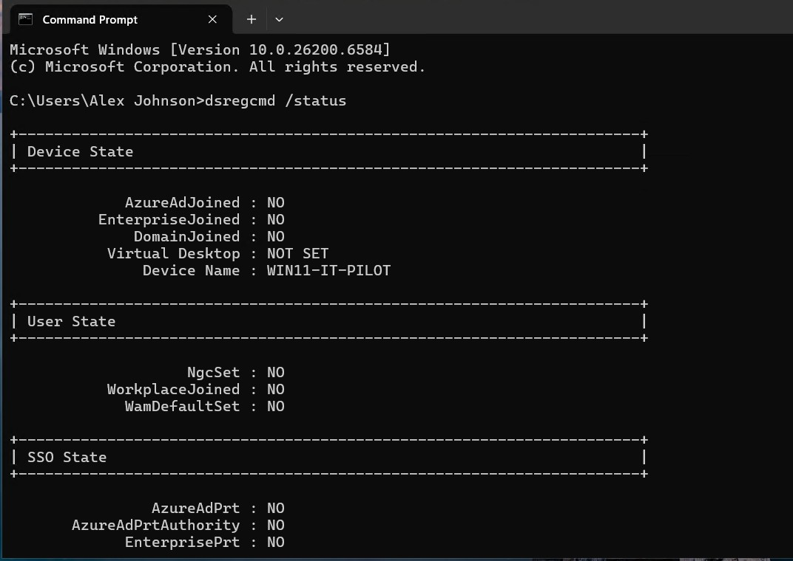

This established a clean baseline for comparison after the Microsoft Entra join.

---

## 3. Verifying Network Connectivity

Because Microsoft Entra join and Intune enrolment depend on communication with Microsoft cloud services, network connectivity was verified before the join.

The pilot VM operates within the existing segmented Proxmox homelab network.

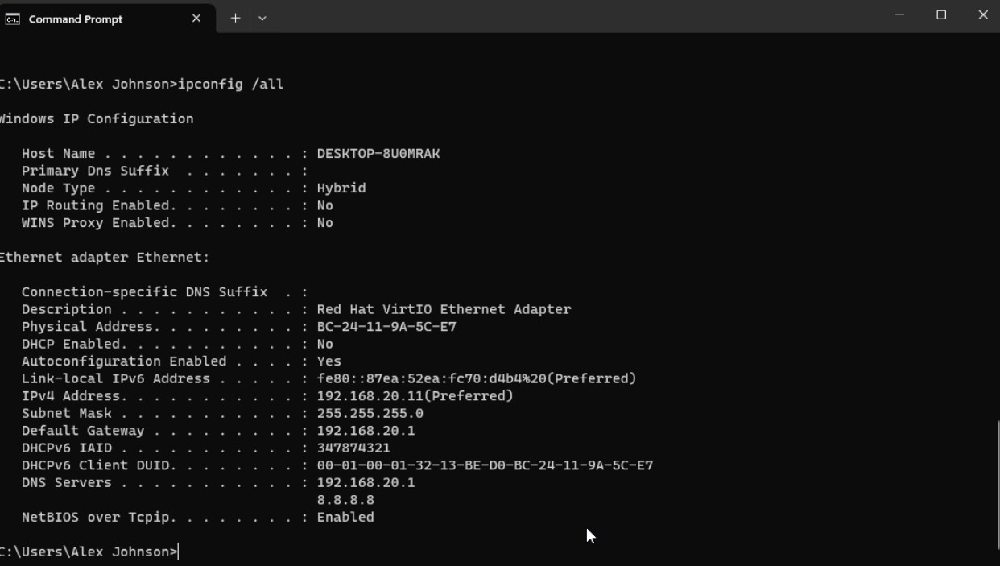

This helped separate local networking issues from Microsoft Entra or Intune enrolment problems during troubleshooting.

---

## 4. Confirming the Initial Cloud Device State

Before performing the final join, both Microsoft Intune and Microsoft Entra ID were checked for existing device records.

### Microsoft Intune

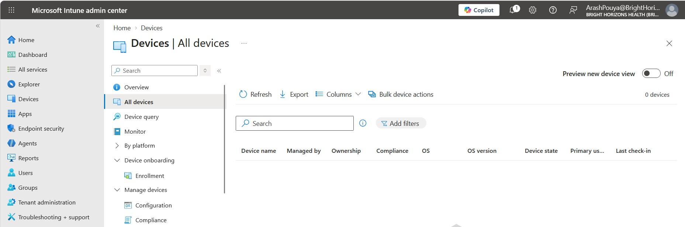

### Microsoft Entra ID

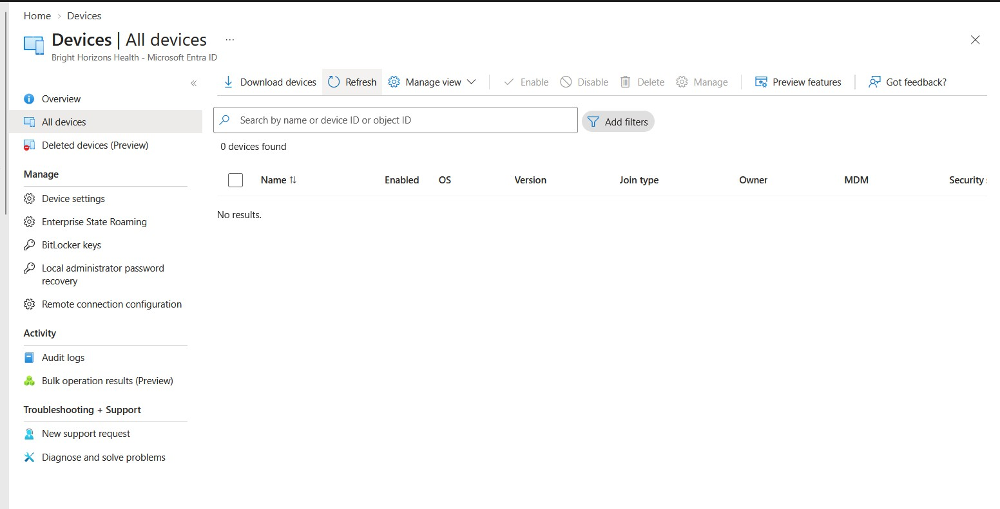

This established a clean cloud-side baseline and made the resulting device objects easy to identify after the join.

---

## 5. Configuring the MDM User Scope

Microsoft Intune automatic enrolment uses the **MDM user scope** to determine which users are targeted for automatic MDM enrolment.

The initial configuration was reviewed before changing it.

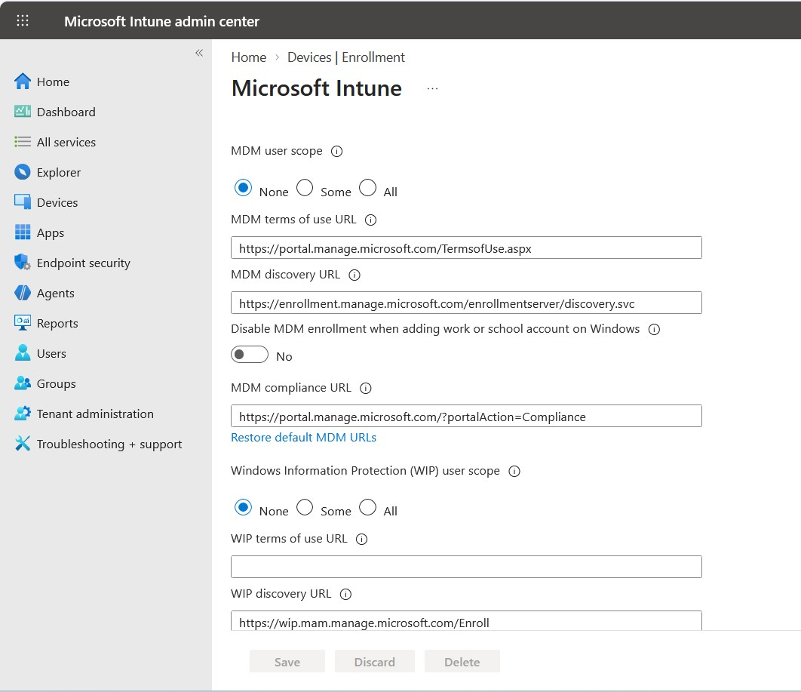

For the lab, I configured:

**MDM user scope: Some**

Rather than immediately targeting every user in the tenant, the deployment was limited to a selected pilot group.

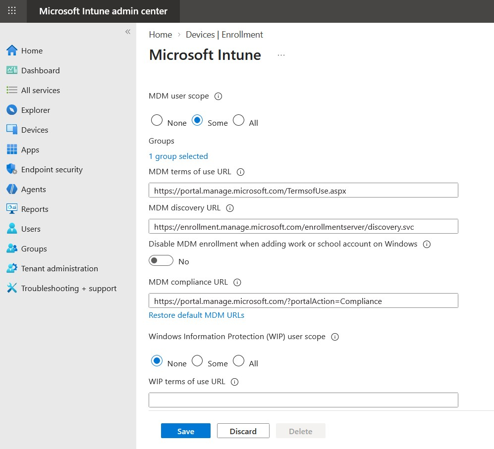

This reflects a more controlled enterprise deployment approach because Intune can first be validated with a limited pilot population before management is expanded to additional users.

Conceptually:

```text
Microsoft Entra Users
        │
        ▼
Selected Pilot Group
        │
        ▼
MDM User Scope = Some
        │
        ▼
Eligible User Joins Device
        │
        ▼
Automatic Intune Enrolment
```

---

## 6. Licensing and User Readiness

Microsoft Intune enrolment depends not only on tenant configuration but also on the user having the required licensing.

The pilot user selected for the Windows device was:

**Alex Johnson**

Before the final controlled enrolment, I verified that Alex had an appropriate Microsoft 365 E3 licence assigned.

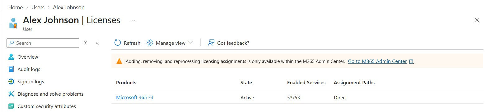

This became important during troubleshooting because an earlier attempt had been performed while Alex did not yet have the required Intune-capable licence.

Rather than assuming that a successful Microsoft Entra identity operation automatically meant successful Intune enrolment, I learned to validate the full chain:

```text
User identity
    ↓
Licence
    ↓
MDM user scope
    ↓
Microsoft Entra join
    ↓
Automatic MDM enrolment
    ↓
Intune management
```

---

## 7. Microsoft Entra Join

For the final controlled deployment, I used the explicit Microsoft Entra join workflow.

From:

**Settings → Accounts → Access work or school → Connect**

I selected the alternate action:

**Join this device to Microsoft Entra ID**

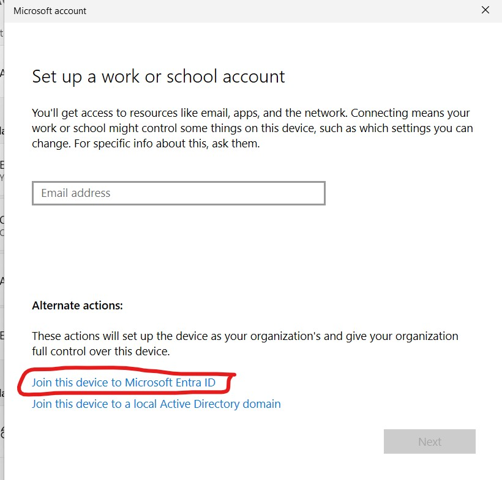

Windows then confirmed the organisation and user identity before completing the join.

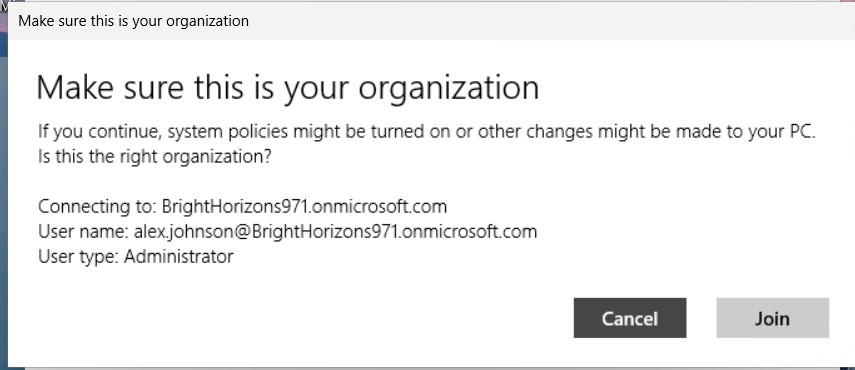

The join completed successfully using the Alex Johnson Microsoft Entra account.

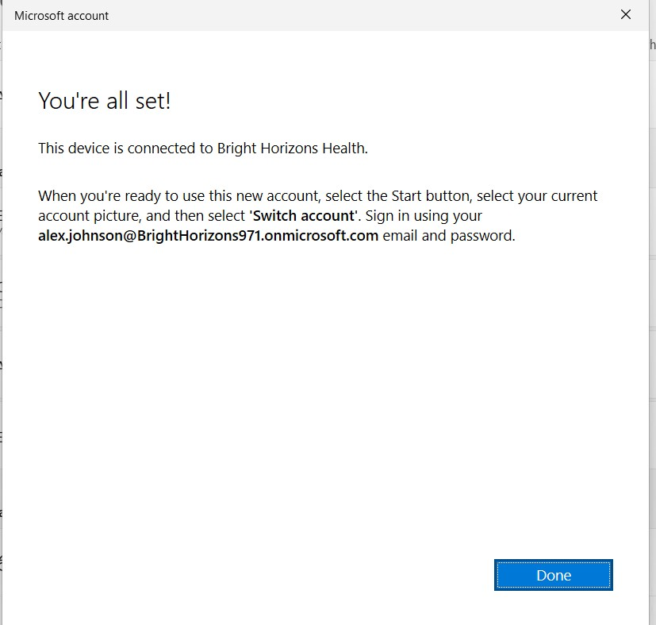

---

## 8. Confirming Windows Management State

Following the join, Windows displayed the Bright Horizons Health connection under:

**Settings → Accounts → Access work or school**

The device showed that it was:

- Connected to Bright Horizons Health's Entra ID
- Managed by Bright Horizons Health

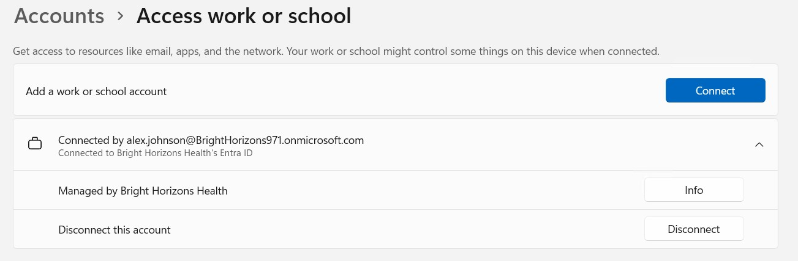

This provided important local confirmation that the endpoint had progressed beyond simply having a Microsoft Entra device identity and had established an organisational management relationship.

---

## 9. Validating the Microsoft Entra Join with `dsregcmd`

After the join, I ran:

```cmd
dsregcmd /status
```

The device now reported:

```text
AzureAdJoined : YES
EnterpriseJoined : NO
DomainJoined : NO
```

Additional information included:

- Device ID
- Device certificate
- TPM-backed key information
- Device authentication status
- Tenant name
- Tenant ID
- MDM discovery URL

The output also showed:

```text
DeviceAuthStatus : SUCCESS
```

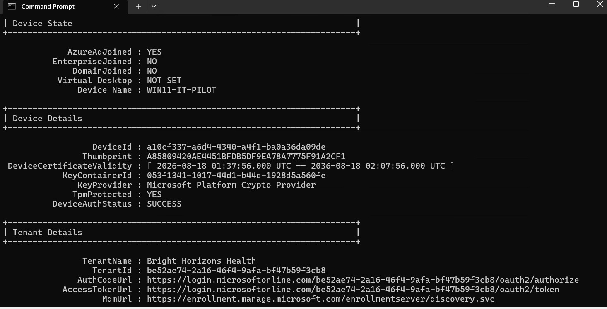

`dsregcmd /status` became one of the most useful troubleshooting tools encountered during the project because it provides a direct Windows-side view of the device identity and tenant relationship.

---

## 10. Validating the Device in Microsoft Entra ID

The device was then verified in Microsoft Entra ID.

`WIN11-IT-PILOT` appeared with the expected organisational identity and management state.

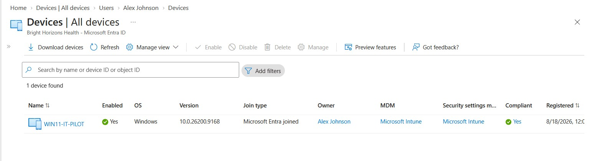

This confirmed the identity side of the deployment.

---

## 11. Validating the Device in Microsoft Intune

The device was also verified in the Microsoft Intune admin center.

The final state showed:

| Property | Result |
|---|---|
| Device | `WIN11-IT-PILOT` |
| Managed by | Intune |
| Ownership | Corporate |
| Compliance | Compliant |
| OS | Windows |
| Device state | Managed |
| Primary user | Alex Johnson |

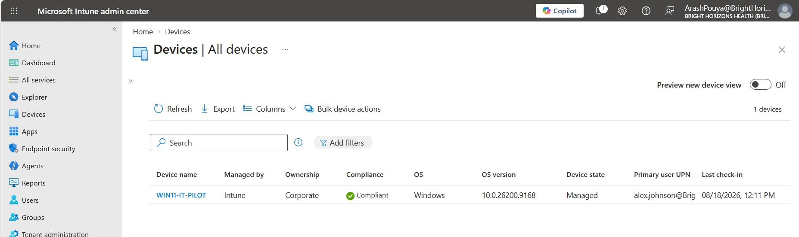

At this point the primary endpoint objective had been achieved:

```text
Microsoft Entra ID
        │
        │ Device identity
        ▼
WIN11-IT-PILOT
        │
        │ Automatic MDM enrolment
        ▼
Microsoft Intune
        │
        ▼
Managed Windows endpoint
```

---

## 12. Troubleshooting the Initial Enrolment Attempt

The pilot deployment did not behave correctly on the first attempt.

Rather than immediately rebuilding the VM, I investigated the enrolment chain.

The troubleshooting process included checking:

- User licensing
- MDM user scope
- Microsoft Entra device objects
- Microsoft Intune device objects
- Windows Access work or school state
- `dsregcmd /status`
- MDM discovery information
- Device Management event logs
- Differences between work/school account connection paths
- Differences between identity join and MDM management state

One failed MDM enrolment attempt produced an automatic discovery error.

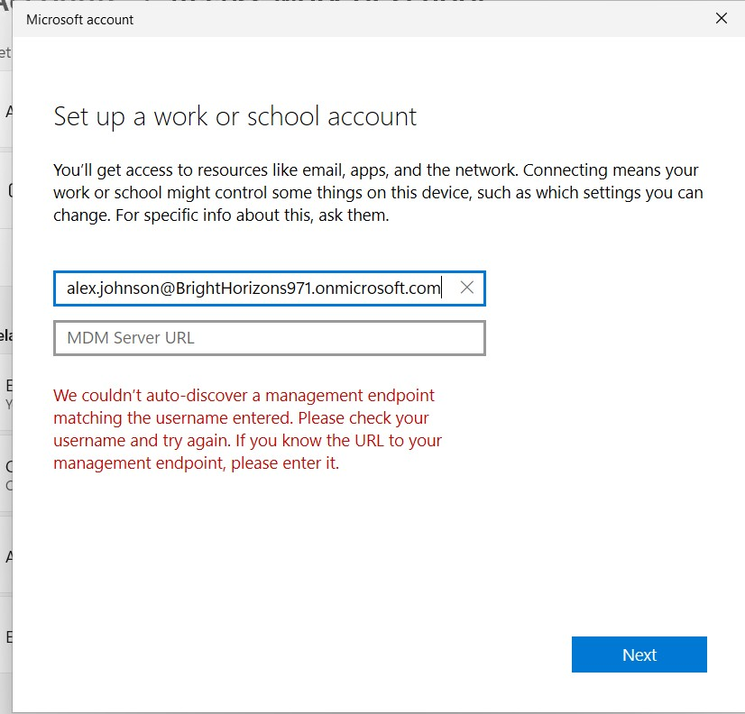

During troubleshooting, I also examined the different paths available from the Windows **Access work or school** interface.

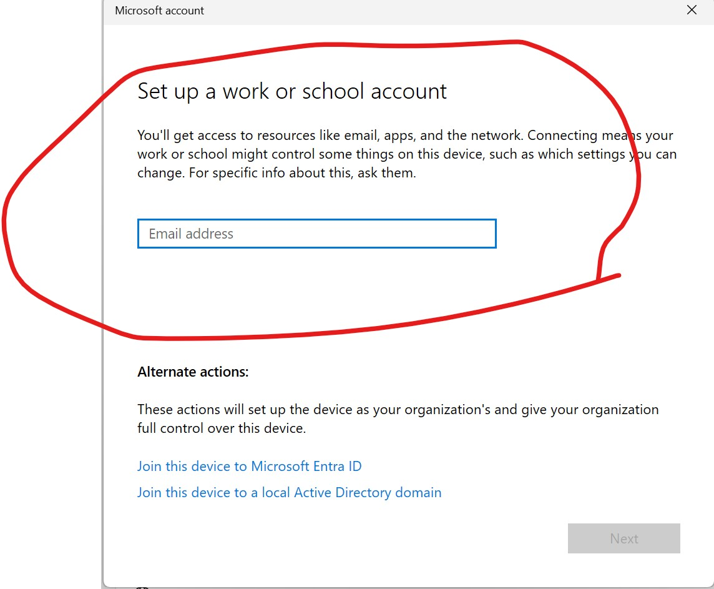

These observations became useful preparation for Project 02, where Microsoft Entra registration, Microsoft Entra join and different device enrolment methods will be tested deliberately.

The key lesson from Project 01 was not to treat:

- Microsoft Entra device identity
- MDM discovery
- Microsoft Intune enrolment

as if they were the same state.

---

## 13. Establishing a Dedicated Intune Administrative Account

A dedicated administrative identity was created for Intune administration rather than relying permanently on the highest-privileged tenant account.

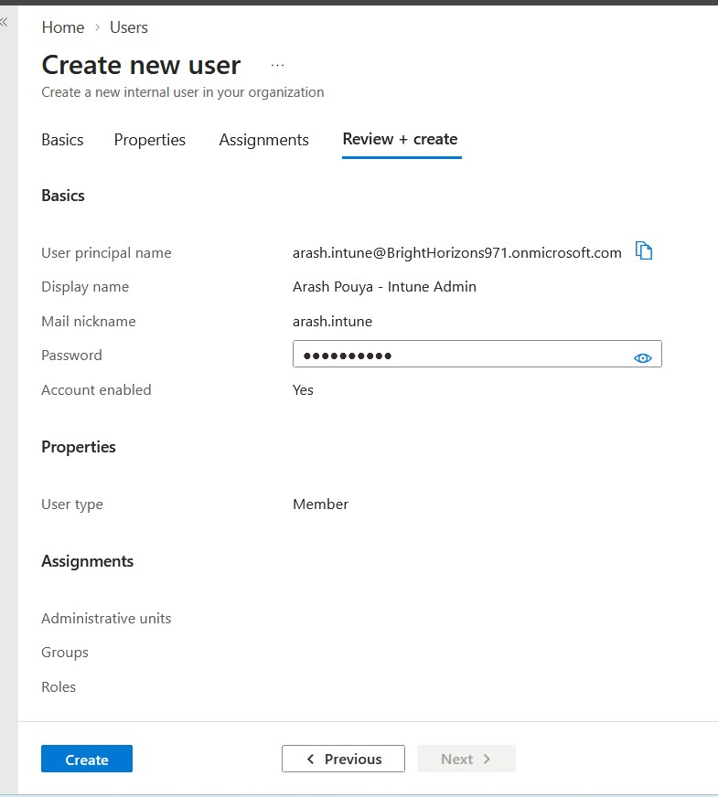

The purpose was to explore delegated administration and the principle of least privilege.

---

## 14. Administrative Groups

A dedicated Intune administrative security group was created to support delegated administration.

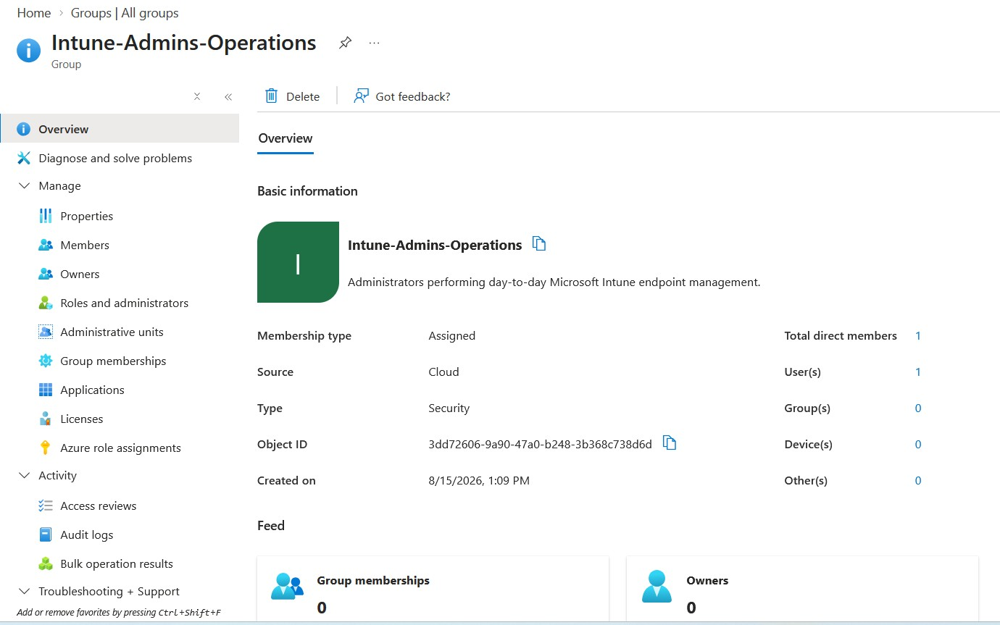

This helped separate:

- the administrator identity itself
- the Intune role
- the administrative scope of that role

---

## 15. Intune RBAC Role Permissions

Microsoft Intune provides its own Role-Based Access Control model.

The **Policy and Profile Manager** role was examined to understand which configuration-management permissions it provides.

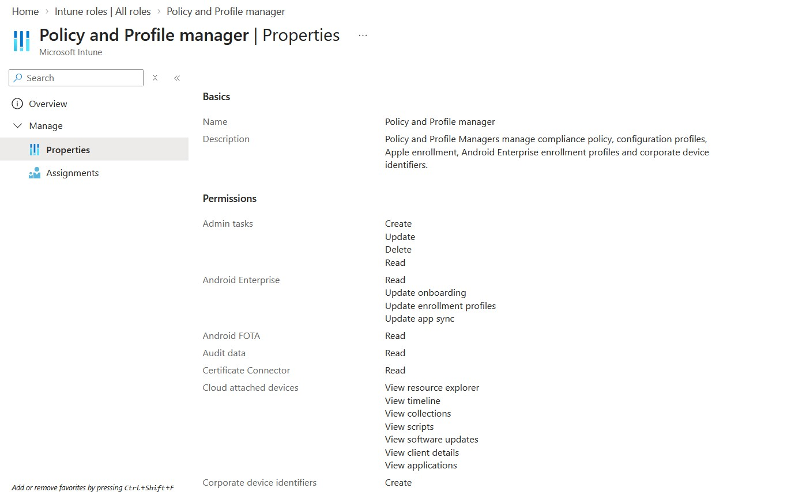

Conceptually, the Intune RBAC model can be understood as:

```text
Role
   │
   ├── Permissions
   ├── Admin Groups
   ├── Scope Groups
   └── Scope Tags
```

These elements answer different questions.

### Role

Defines **what the administrator is allowed to do**.

### Admin Groups

Define **who receives the delegated role assignment**.

### Scope Groups

Define **which users and devices the administrator can manage**.

### Scope Tags

Help define **which Intune-managed objects are visible within an administrative boundary**.

---

## 16. Admin Groups and Scope Groups

The RBAC role assignment was configured using both administrative and scope groups.

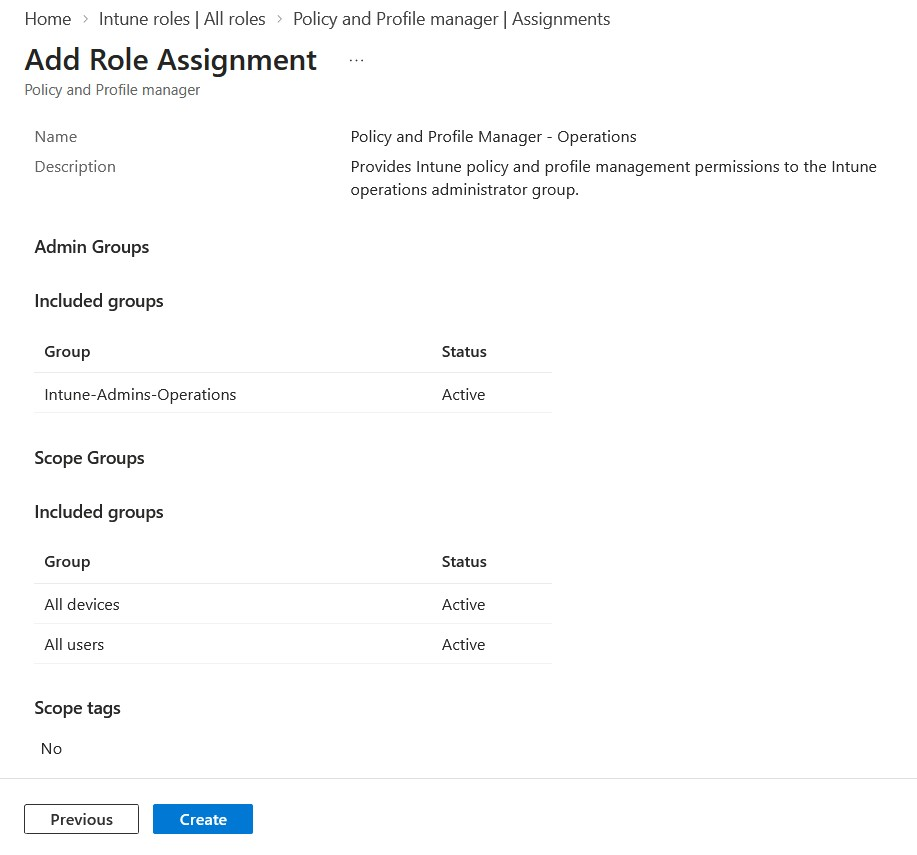

This was one of the most useful conceptual lessons in the project because admin groups and scope groups can initially appear similar, but they perform different functions.

A simple way to remember the distinction is:

```text
Admin Group
    ↓
WHO receives the role?

Scope Group
    ↓
WHICH users/devices can they manage?
```

---

## 17. Scope Tags

Scope tags were also explored as part of the delegated administration model.

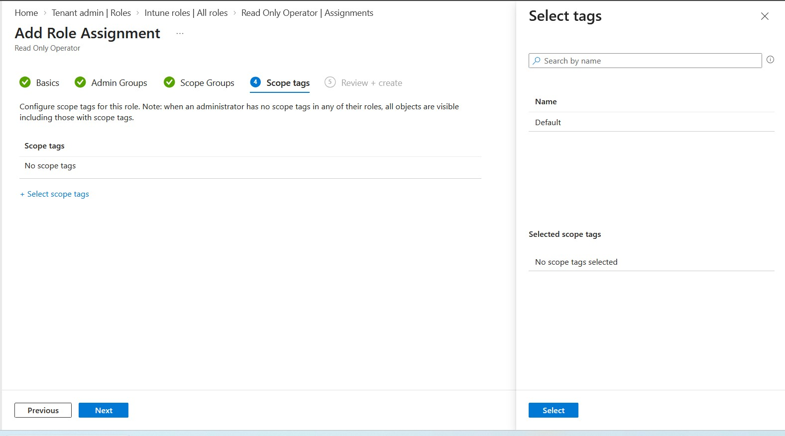

Scope tags add another administrative boundary by controlling which Intune objects are visible to administrators assigned to matching scope tags.

They are therefore different from scope groups:

```text
Scope Group
    ↓
Users and devices

Scope Tag
    ↓
Intune objects/resources
```

---

## 18. Testing Least-Privilege Administration

The delegated Intune administrative account was tested by signing into the Microsoft Intune admin center separately from the primary tenant administrator account.

One of the most useful tests involved:

**Devices → All devices**

The delegated account received:

> **Unauthorized – You don't have authorization to retrieve any devices.**

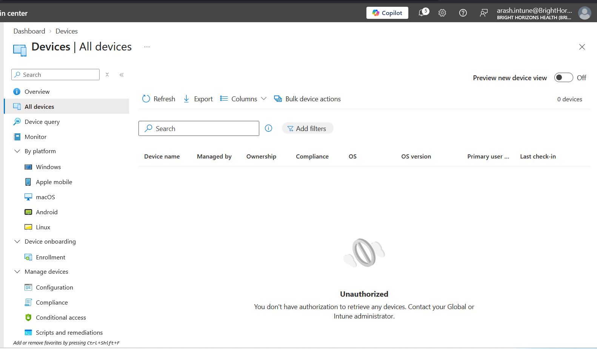

This demonstrated that being able to access the Intune admin center does not automatically mean having unrestricted access to every managed resource.

---

## 19. Configuration Policy Access

The same delegated account was able to access:

**Devices → Configuration**

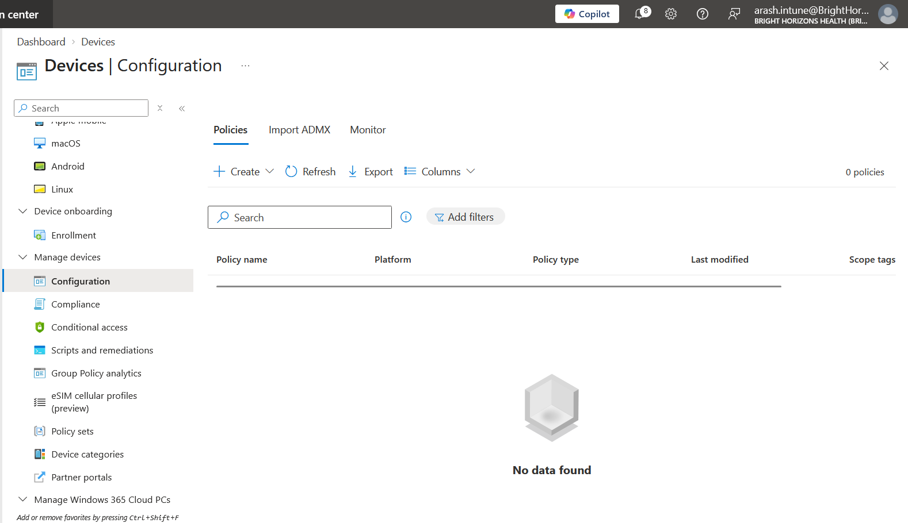

The account was also able to begin creating a Windows Settings Catalog profile.

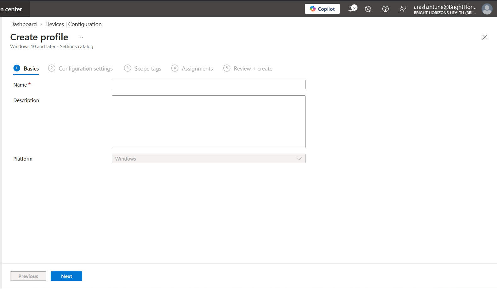

This produced a clear practical demonstration of least privilege:

```text
Policy configuration access     ✅
General managed-device access   ❌
```

---

## 20. User Administration Boundary

The delegated Intune administrator could view directory users, but user-administration actions were unavailable.

Actions such as:

- Edit properties
- Add manager
- Add to group
- Edit account status
- Revoke sessions
- Delete user

were restricted.

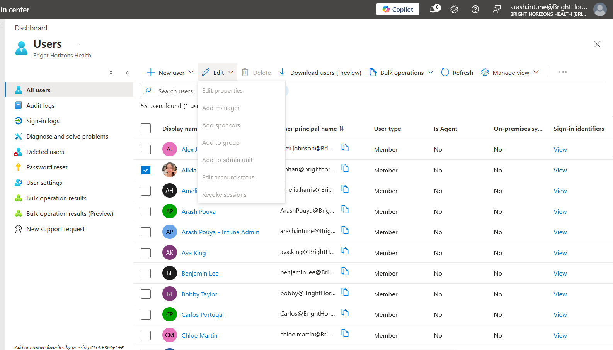

This reinforced an important distinction:

> Endpoint administration permissions do not automatically provide Microsoft Entra identity-administration permissions.

An administrator may require visibility of users for policy assignments and endpoint administration without requiring authority to modify those users.

---

## 21. Troubleshooting Method Used

The enrolment problem reinforced a structured troubleshooting process that can be reused in future Intune work.

```text
1. Confirm user identity
        ↓
2. Confirm licence
        ↓
3. Confirm MDM user scope
        ↓
4. Confirm local device state
        ↓
5. Confirm network/cloud connectivity
        ↓
6. Perform Microsoft Entra join
        ↓
7. Check local management connection
        ↓
8. Check Microsoft Entra device object
        ↓
9. Check Microsoft Intune managed-device object
        ↓
10. Review MDM/Event Viewer diagnostics if needed
```

The important lesson was to correlate information from several places rather than relying on a single portal:

- Windows
- Microsoft Entra ID
- Microsoft Intune
- Event Viewer
- `dsregcmd`

---

## 22. Final Project State

At the completion of Project 01:

### Microsoft Intune

- Intune environment operational
- Microsoft 365 E3 trial available
- MDM user scope configured for a selected pilot population
- Pilot user appropriately licensed
- Dedicated Intune administrative identity created
- RBAC role behaviour tested
- Admin groups and scope groups explored
- Scope tags explored
- Least-privilege administration demonstrated
- Windows pilot device successfully enrolled
- Device management and synchronisation operational

### Microsoft Entra ID

- `WIN11-IT-PILOT` successfully Microsoft Entra joined
- Device associated with Alex Johnson
- MDM association visible as Microsoft Intune
- Device authentication successful

### Windows 11

- `WIN11-IT-PILOT` successfully Microsoft Entra joined
- Intune management relationship established
- `dsregcmd /status` validated
- MDM troubleshooting tools identified
- Device ready for subsequent Intune lab projects

---

# Key Lessons Learned

## 1. Microsoft Entra Join and Intune Enrolment Are Related but Distinct

A device identity existing in Microsoft Entra ID does not by itself prove that the endpoint is successfully managed by Microsoft Intune.

Both states should be validated independently.

## 2. Licensing Is Part of the Enrolment Chain

When troubleshooting enrolment, user licensing should be checked early rather than focusing only on the endpoint.

The project showed that successful authentication or Microsoft Entra device identity operations do not automatically prove successful Intune enrolment.

## 3. MDM User Scope Matters

Automatic Intune enrolment applies only to users targeted by the configured MDM user scope.

Using **Some** provides a controlled way to pilot Intune before expanding enrolment more broadly.

## 4. Pilot Deployments Reduce Risk

The project deliberately used a selected user and pilot Windows VM before expanding endpoint management.

The same pilot-first model will be reused for:

- Configuration profiles
- Compliance policies
- Applications
- Endpoint security
- Windows Update policies

## 5. Windows Provides Multiple Work/School Connection Paths

The Windows **Access work or school** interface provides more than one organisational connection workflow.

For the final controlled corporate device deployment in this project, I used:

**Join this device to Microsoft Entra ID**

The deeper distinction between:

- Microsoft Entra registered
- Microsoft Entra joined
- MDM enrolled

will be investigated systematically in Project 02.

## 6. `dsregcmd /status` Is an Important Troubleshooting Tool

`dsregcmd /status` provides direct visibility into:

- Microsoft Entra join state
- Device ID
- Device certificate
- Device authentication status
- Tenant information
- MDM discovery URLs
- SSO state

It provides valuable endpoint-side evidence that can be correlated with Microsoft Entra ID and Microsoft Intune.

## 7. Intune RBAC Is More Than Assigning an Administrator Role

Effective Intune delegation requires understanding the relationship between:

- Roles
- Permissions
- Admin groups
- Scope groups
- Scope tags

These concepts determine not only what an administrator can do but also where those permissions apply.

## 8. Visibility Does Not Equal Administrative Authority

The delegated Intune administrator could see directory users but could not modify them.

This demonstrated that read visibility and administrative permissions are separate concepts.

## 9. Least Privilege Should Be Tested, Not Assumed

Creating a restricted administrator is only the first step.

The account should actually be used to verify:

- What it can see
- What it can modify
- What it cannot access
- Whether the intended administrative boundary works

The access-denied results were therefore useful evidence that RBAC restrictions were functioning.

## 10. Troubleshooting Added More Value Than a Perfect First-Time Deployment

The unexpected enrolment behaviour required investigation across:

- Windows
- Microsoft Entra ID
- Microsoft Intune
- Licensing
- MDM user scope
- Device identity
- Event logs
- RBAC

As a result, the project provided substantially more practical troubleshooting experience than a simple successful click-through enrolment would have provided.

---

# Skills Demonstrated

This project demonstrates practical experience with:

- Microsoft Intune administration
- Microsoft Entra ID
- Microsoft 365 licensing
- Windows 11 Enterprise
- Microsoft Entra Join
- Automatic MDM enrolment
- MDM user scope configuration
- Pilot deployment methodology
- Intune Role-Based Access Control
- Admin groups
- Scope groups
- Scope tags
- Least-privilege administration
- Administrative delegation
- Windows device identity troubleshooting
- `dsregcmd`
- Windows Event Viewer
- DeviceManagement-Enterprise-Diagnostics-Provider logs
- Intune device synchronisation
- Cross-platform troubleshooting between endpoint and cloud portals
- Enterprise-style technical documentation

---


# Next Project

## Project 02 – Device Enrolment & Autopilot

Project 02 will build on the foundation established here and investigate device identity and enrolment in greater depth.

Planned areas include:

- Microsoft Entra registered devices
- Microsoft Entra joined devices
- MDM enrolment
- User-driven enrolment
- Corporate vs personal device scenarios
- Device ownership
- Enrolment restrictions
- Automatic enrolment behaviour
- Windows Autopilot concepts and implementation where supported
- Comparison of device states using `dsregcmd /status`
- Enrolment troubleshooting

This will allow the registration and enrolment behaviours encountered incidentally during Project 01 to be tested deliberately and documented in a controlled manner.

---

# Project Outcome

**Status: Completed ✅**

Project 01 established the administrative and endpoint-management foundation required for the remainder of the Microsoft Intune homelab.

The project resulted in:

- A validated Intune environment
- Controlled MDM automatic enrolment scope
- A licensed pilot user
- A Microsoft Entra joined Windows 11 Enterprise pilot endpoint
- Successful automatic Microsoft Intune enrolment
- A managed and compliant corporate endpoint
- A delegated Intune administrative account
- Tested RBAC boundaries
- Practical understanding of admin groups, scope groups and scope tags
- Hands-on enrolment and troubleshooting experience

The environment is now ready for deeper device enrolment, configuration, compliance, application management, endpoint security and lifecycle-management projects.
