# Project 02 – Device Enrollment and Windows Autopilot

## Overview

This project focused on enrolling and provisioning Windows 11 devices through Microsoft Entra ID, Microsoft Intune, and Windows Autopilot.

The lab explored the practical differences between personal/BYOD registration and corporate Microsoft Entra join, automatic MDM enrollment, device ownership, lifecycle actions, Windows Autopilot registration and deployment, and validation of successfully provisioned devices.

The project also included troubleshooting of Windows Sysprep, reserved storage, BitLocker encryption, AppX provisioning conflicts, MFA re-registration, and local administrator behaviour.

---

## Business Scenario

Bright Horizons Health requires a consistent method for onboarding both personal and corporate Windows devices.

The organisation needs to support:

- Personal/BYOD devices that require limited organisational access and management.
- Corporate Windows devices that are Microsoft Entra joined and fully managed through Microsoft Intune.
- Automated provisioning of new corporate devices through Windows Autopilot.
- Standard-user deployment to support the principle of least privilege.
- Centralised lifecycle management through Intune.
- A repeatable provisioning process suitable for remote employees.

The lab was designed to simulate these requirements using Windows 11 virtual machines in a Proxmox environment.

---

## Learning Objectives

The objectives of this project were to:

- Understand the difference between Microsoft Entra registered and Microsoft Entra joined devices.
- Configure and validate automatic Intune MDM enrollment.
- Enroll and manage personal/BYOD Windows devices.
- Perform and evaluate Intune device lifecycle actions such as Wipe.
- Manually join a corporate Windows device to Microsoft Entra ID.
- Validate device identity using `dsregcmd /status`.
- Understand local administrator behaviour during manual Microsoft Entra join.
- Prepare networking requirements for Windows Autopilot.
- Capture and import a Windows Autopilot hardware hash.
- Create and assign a Windows Autopilot deployment profile.
- Configure a standard-user Autopilot deployment.
- Prepare an existing Windows VM for OOBE using Sysprep.
- Troubleshoot Sysprep failures.
- Validate successful Autopilot provisioning across Windows, Microsoft Entra ID, and Microsoft Intune.
- Understand the relationship between Autopilot, Microsoft Entra ID, and Intune.

---

## Technologies Used

- Microsoft Intune
- Microsoft Entra ID
- Windows Autopilot
- Microsoft 365 E3
- Windows 11
- PowerShell
- Windows Sysprep
- Proxmox VE
- pfSense
- DHCP
- Remote Desktop Protocol
- Microsoft Authenticator

---

## Lab Environment

The project used the Bright Horizons Health Microsoft 365 lab tenant and Windows 11 virtual machines hosted in Proxmox.

The Windows client network was connected through pfSense using the `192.168.20.0/24` subnet.

DHCP was enabled on the pfSense client interface to support Windows Autopilot and OOBE provisioning.

Example DHCP configuration:

- Network: `192.168.20.0/24`
- Gateway: `192.168.20.1`
- DHCP range: `192.168.20.100 – 192.168.20.199`

The primary test user for corporate enrollment and Autopilot was **Emily Nguyen**.

---

# 1. Automatic MDM Enrollment

Automatic Intune enrollment was configured using the Microsoft Intune MDM user scope.

The lab used:

- **MDM user scope:** Some
- **Target group:** Intune users pilot

This allows selected licensed users to automatically enroll Microsoft Entra joined Windows devices into Intune.

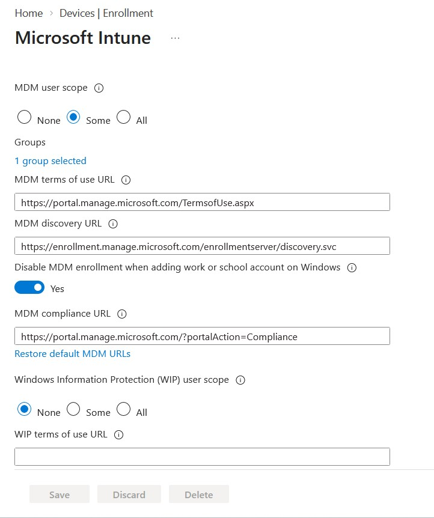

A key learning point was that Microsoft Entra join and Intune enrollment are separate processes.

A device can successfully become Microsoft Entra joined while failing to automatically enroll into Intune if the user is not included in the configured MDM scope.

---

# 2. BYOD / Microsoft Entra Registered Device

The first enrollment scenario represented a personal Windows device.

Before connecting the work account, the device was validated using:

```powershell
dsregcmd /status
```

The initial state confirmed that the device was neither Microsoft Entra joined nor workplace registered.

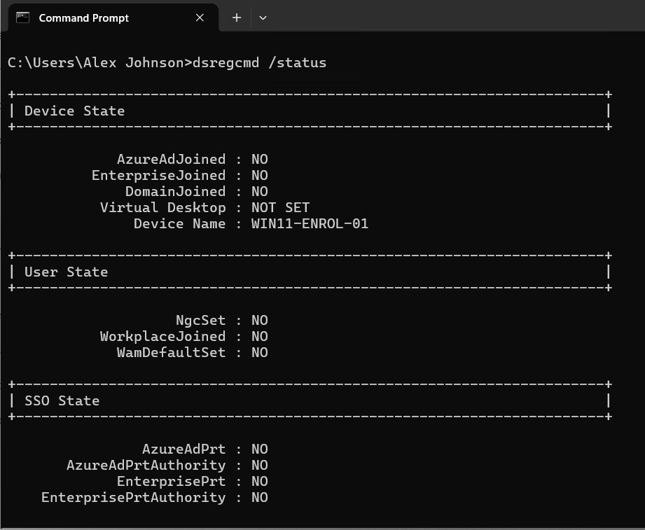

Emily's Bright Horizons Health work account was then connected through Windows.

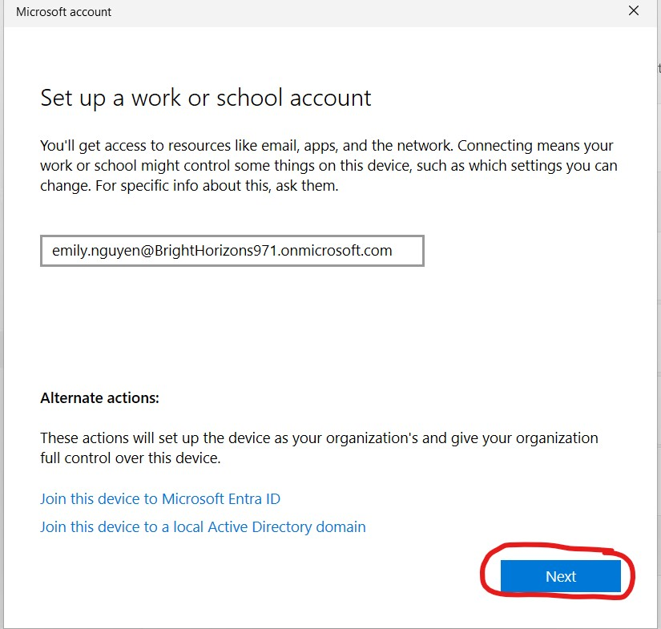

The device successfully became Microsoft Entra registered and was enrolled into Intune as a personal device.

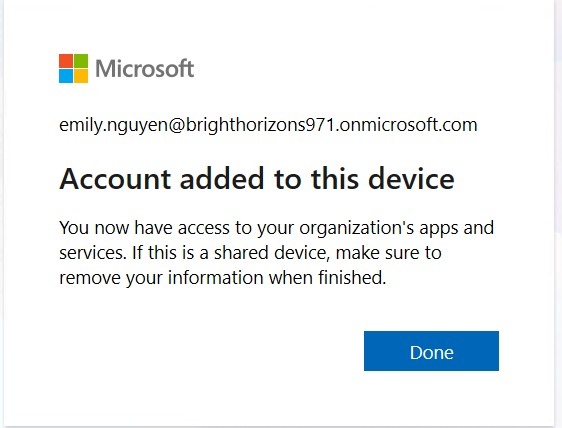

This demonstrated the typical BYOD model:

```text
Personal Windows Device
        ↓
Microsoft Entra Registered
        ↓
Intune Enrolled
        ↓
Ownership: Personal
```

The device retained a personal Windows identity while allowing organisational management through Intune.

---

# 3. Device Lifecycle – Intune Wipe

The registered device was used to test the Intune **Wipe** remote action.

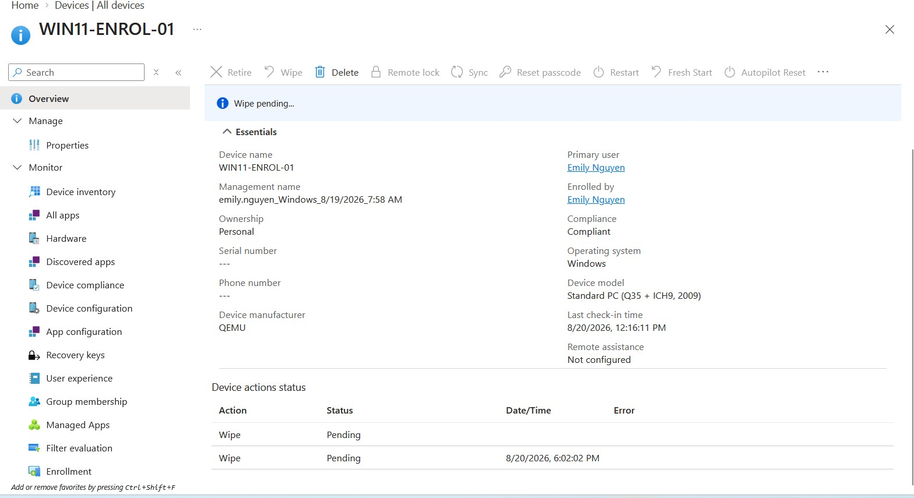

The wipe returned the Windows VM to OOBE and removed the active Intune-managed state.

The Microsoft Entra registered object remained temporarily visible after the wipe.

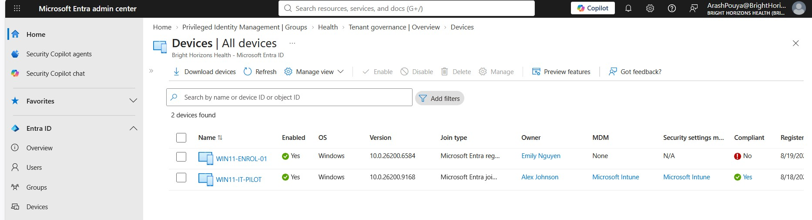

This exercise highlighted an important operational consideration for BYOD environments:

> Device lifecycle actions must be selected carefully because a full Windows wipe can remove both organisational and personal data.

This reinforced the importance of user communication, device ownership classification, and appropriate lifecycle procedures.

---

# 4. Manual Microsoft Entra Join

A separate corporate-device scenario was tested using a manual Microsoft Entra join.

From Windows, the option **Join this device to Microsoft Entra ID** was selected.

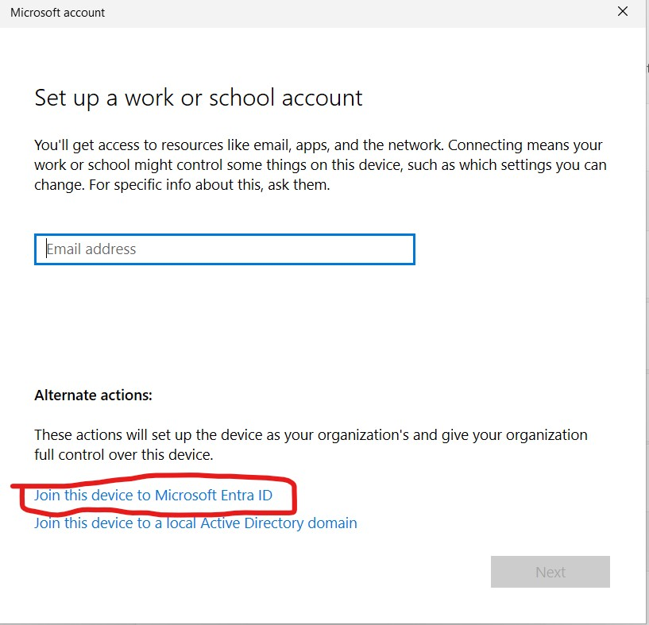

After the join, `dsregcmd /status` confirmed:

```text
AzureAdJoined : YES
```

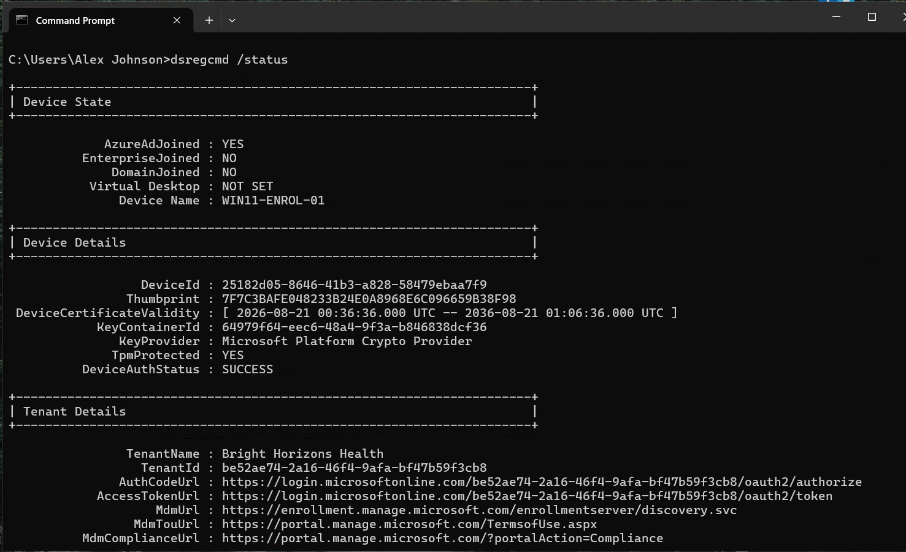

The device was also automatically enrolled into Intune because the joining user was within the configured MDM user scope.

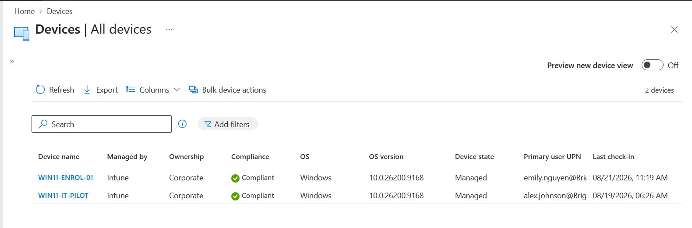

## Local Administrator Behaviour

During manual Microsoft Entra join, the joining user became a member of the local Windows Administrators group.

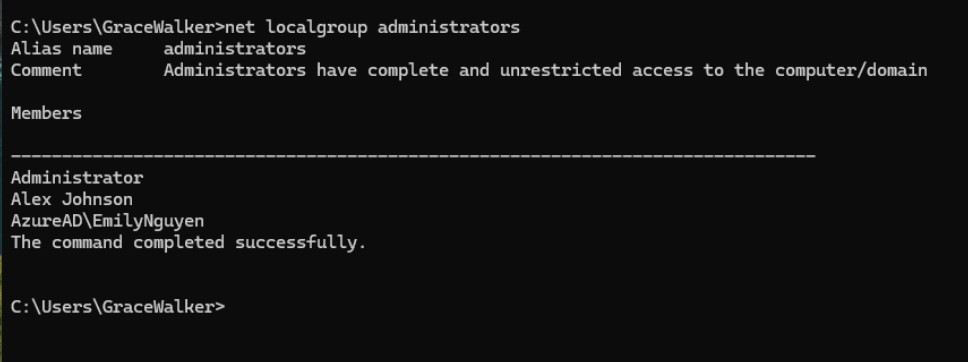

A second Microsoft Entra user was also successfully able to sign in to the device.

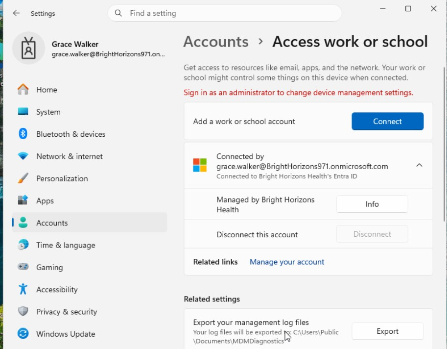

This demonstrated that a Microsoft Entra joined device is not tied exclusively to the user who originally joined it.

The exercise also highlighted why enterprise deployments should deliberately control local administrator access rather than allowing normal users to retain permanent administrative privileges.

---

# 5. Preparing the Network for Windows Autopilot

Windows Autopilot requires reliable network connectivity during OOBE.

DHCP was enabled on the pfSense Windows-client interface.

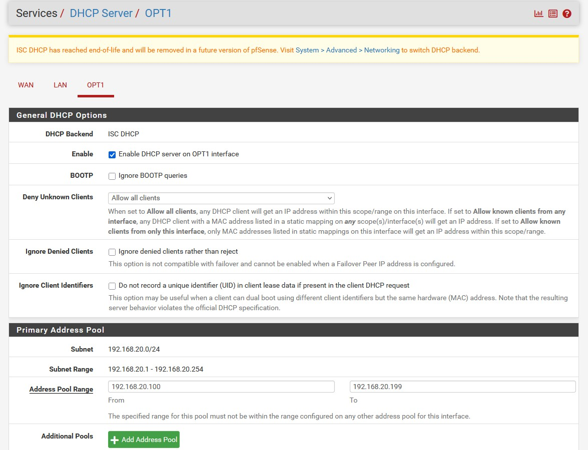

The Autopilot VM successfully received an address through DHCP.

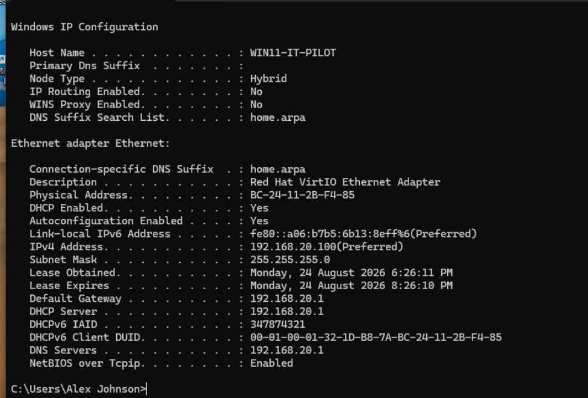

This allowed the device to reach Microsoft cloud services automatically during the provisioning process.

---

# 6. Windows Autopilot Hardware Registration

A dedicated Windows 11 VM was prepared for the Autopilot test.

Hardware identity information was reviewed before collecting the Autopilot hardware hash.

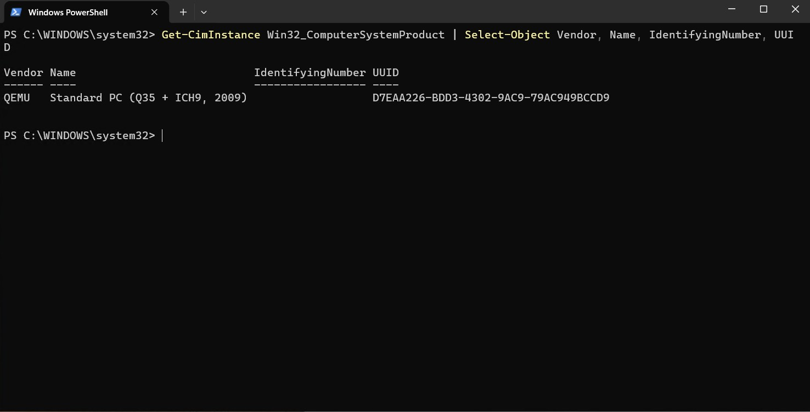

The Microsoft `Get-WindowsAutopilotInfo` PowerShell script was installed and used to collect the device hardware hash.

```powershell
Install-Script -Name Get-WindowsAutopilotInfo

Get-WindowsAutopilotInfo -OutputFile AutopilotHWID.csv
```

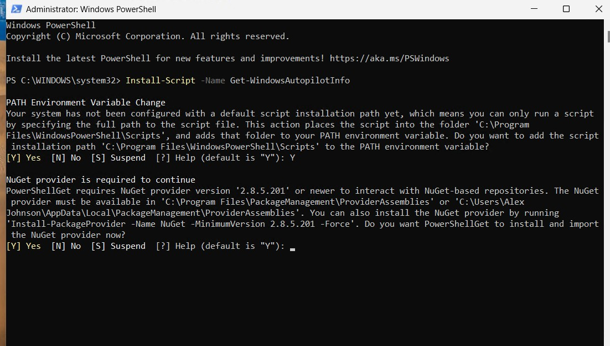

The resulting CSV was imported into Windows Autopilot in Intune.

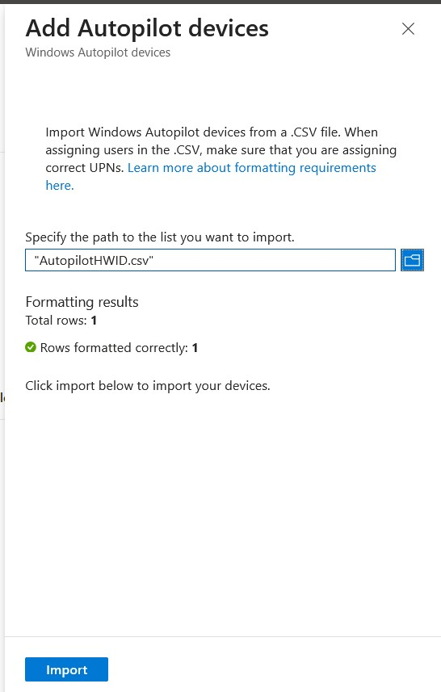

After registration, a corresponding Autopilot-related device object became visible in Microsoft Entra ID.

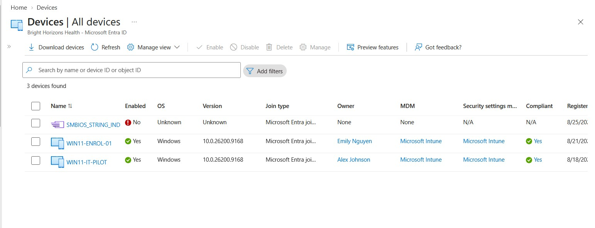

A key lesson was that the cloud-side Autopilot device object can exist before the Windows installation itself has completed Microsoft Entra join.

The actual endpoint join state should therefore be validated from Windows using `dsregcmd /status`.

---

# 7. Autopilot Deployment Profile

A user-driven Windows Autopilot deployment profile was created:

**Profile name**

`BHH_Autopilot_UserDriven`

The profile was configured to:

- Use user-driven deployment.
- Join the device to Microsoft Entra ID.
- Hide Microsoft licence terms.
- Hide privacy settings.
- Configure the user as a **Standard** user.
- Use English (Australia).
- Automatically configure the keyboard.
- Apply the device naming convention:

```text
BHH-%RAND:6%
```

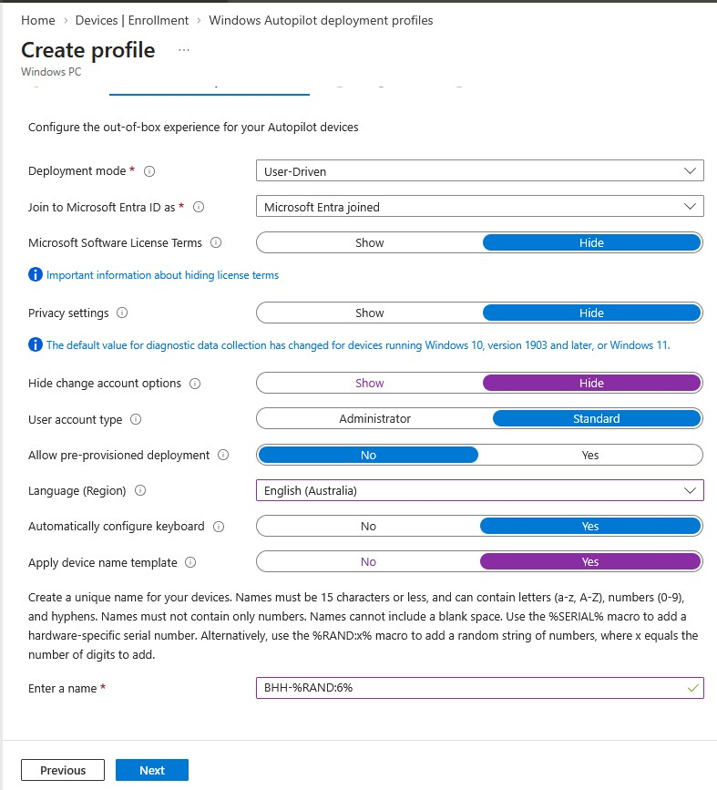

The configuration was reviewed before creation.

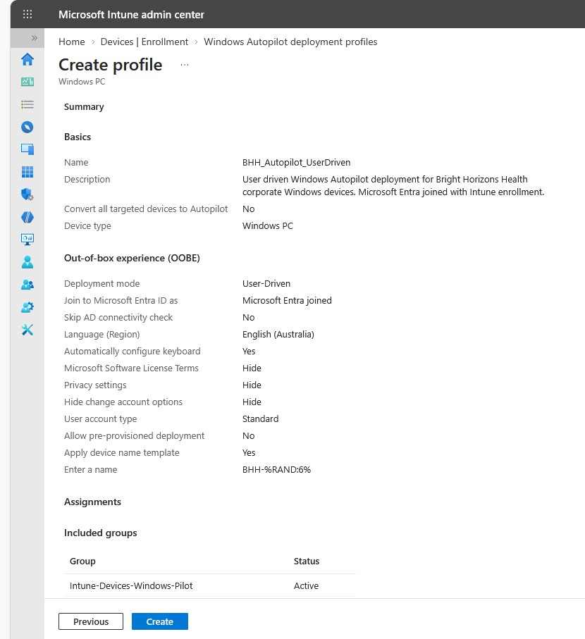

The Autopilot device was added to the assigned device group and the profile status changed to **Assigned**.

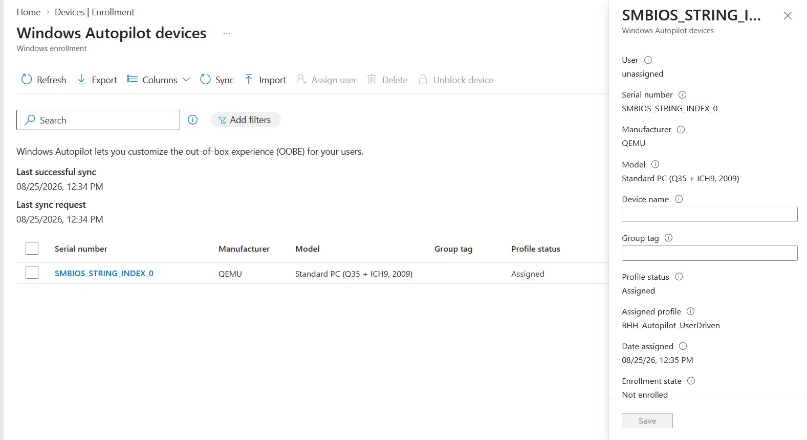

This reinforced the distinction between two different targeting mechanisms:

```text
Device
  ↓
Autopilot device group
  ↓
Autopilot deployment profile
```

and:

```text
User
  ↓
MDM user scope
  ↓
Automatic Intune enrollment
```

---

# 8. Preparing Windows for OOBE

Because the Autopilot test used an existing Windows VM rather than a factory-new computer, the VM needed to be returned to OOBE.

Windows Sysprep was used with:

- Out-of-Box Experience
- Generalize
- Shutdown

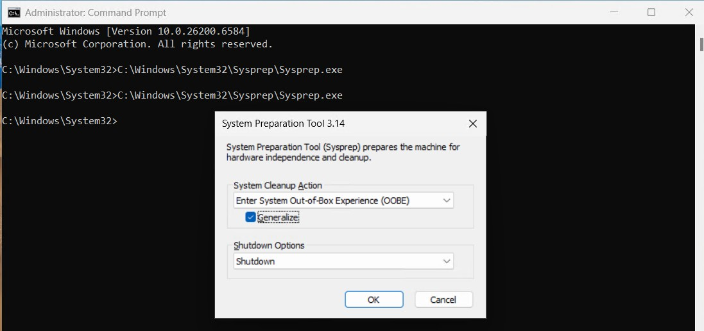

Several real troubleshooting issues were encountered before Sysprep successfully completed.

---

# 9. Troubleshooting

## Reserved Storage

Sysprep initially failed because Windows Reserved Storage was in use.

Reserved Storage was disabled using DISM:

```powershell
DISM.exe /Online /Set-ReservedStorageState /State:Disabled
```

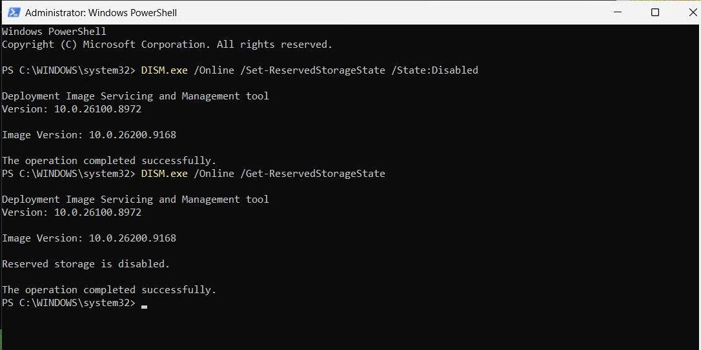

## BitLocker

Sysprep later reported that BitLocker encryption was enabled on the operating system volume.

Although BitLocker protection showed as **Off**, the volume was still encrypted.

The volume was fully decrypted using:

```powershell
manage-bde -off C:
```

A key lesson was:

> BitLocker Protection Off does not necessarily mean that the disk is decrypted.

## AppX Provisioning Conflict

Sysprep also failed because a Windows handwriting package was installed for a user but was not provisioned for all users.

The affected AppX packages were identified and removed before Sysprep was attempted again.

After resolving Reserved Storage, BitLocker, and AppX issues, Sysprep completed successfully.

## MFA Re-registration

During Autopilot OOBE, Emily's Microsoft Authenticator registration no longer matched the state of the Authenticator application on the mobile device.

The user's MFA registration was reset and Microsoft Authenticator was registered again.

This provided a practical example of MFA recovery during endpoint provisioning.

---

# 10. Windows Autopilot Provisioning

After Sysprep, the device restarted into Windows OOBE.

The Autopilot experience presented the organisational work-or-school sign-in flow.

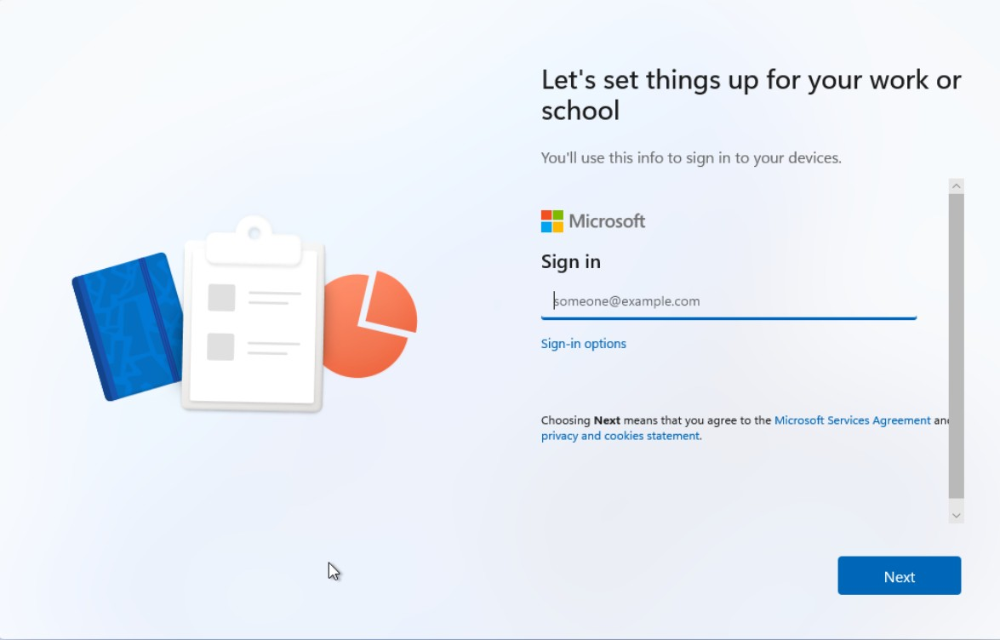

Emily authenticated using her Bright Horizons Health account and completed MFA.

Windows Autopilot then:

1. Identified the registered device.
2. Applied the assigned Autopilot deployment profile.
3. Joined the device to Microsoft Entra ID.
4. Triggered automatic Intune enrollment.
5. Applied the configured device naming convention.
6. Provisioned Emily as a standard user.

---

# 11. Final Validation

The successfully provisioned device was named:

```text
BHH-528789
```

This confirmed that the Autopilot naming template had been applied.

## Windows Validation

`dsregcmd /status` confirmed:

```text
AzureAdJoined : YES
DomainJoined  : NO
DeviceAuthStatus : SUCCESS
```

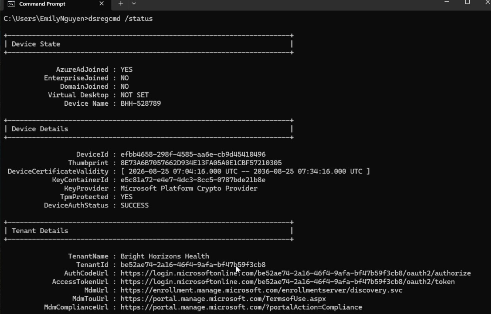

## Intune Validation

The device successfully appeared in Microsoft Intune.

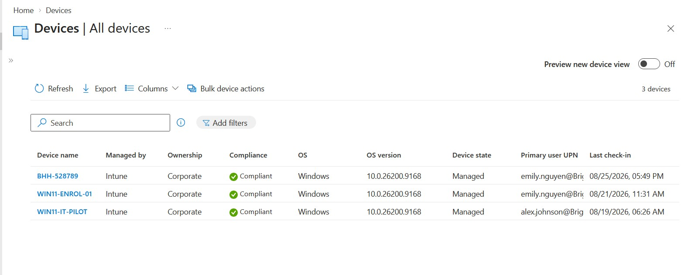

The device overview confirmed:

- Managed by Microsoft Intune
- Ownership: Corporate
- Primary user: Emily Nguyen
- Enrolled by: Emily Nguyen
- Compliance: Compliant
- Manufacturer: QEMU

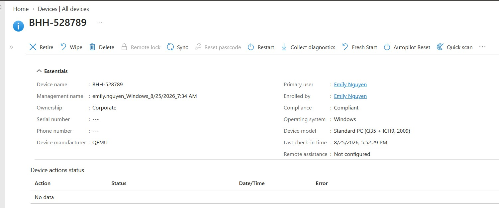

## Microsoft Entra Validation

Microsoft Entra ID showed the same device as:

- Microsoft Entra joined
- Managed by Microsoft Intune
- Compliant
- Owned by Emily Nguyen
- Recognised as a Windows Autopilot device

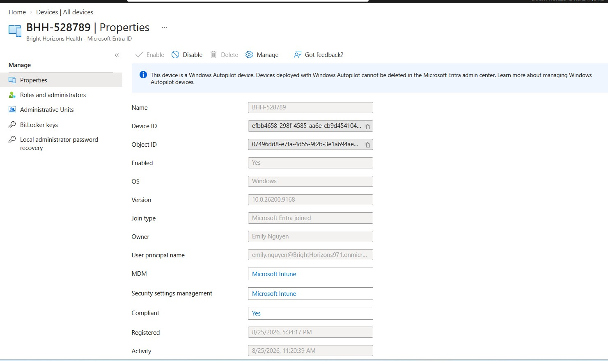

The matching device identity across Windows, Microsoft Entra ID, and Microsoft Intune provided end-to-end validation of the deployment.

---

# Key Concepts Reinforced

## Microsoft Entra Registered vs Joined

**Microsoft Entra registered**

Typically supports personal/BYOD scenarios where the user connects an organisational account to an existing personal Windows installation.

**Microsoft Entra joined**

Creates a corporate cloud device identity and allows organisational users to authenticate directly to Windows using Microsoft Entra credentials.

## Autopilot vs Entra ID vs Intune

The project reinforced the different responsibilities of each service:

```text
Windows Autopilot
Provisioning and OOBE orchestration
        ↓
Microsoft Entra ID
Device identity and authentication
        ↓
Microsoft Intune
Device management, configuration and lifecycle
```

These services integrate closely but perform different functions.

## Managed vs Compliant

A device being **Managed** means it is enrolled in Intune and can receive management policies.

A device being **Compliant** means Intune has evaluated it against configured compliance requirements.

Management and compliance are therefore separate device states.

## Principle of Least Privilege

The Autopilot profile configured the enrolling user as a **Standard** user.

This is preferable to automatically granting permanent local administrator rights to normal employees.

Future endpoint-security work will explore controlled local administrator access and Windows LAPS.

---

# Lessons Learned

The project produced several practical lessons:

- Microsoft Entra join and Intune enrollment are separate processes.
- MDM user scope controls automatic Intune enrollment for selected users.
- Device ownership affects appropriate lifecycle and management decisions.
- A Windows Wipe can have significant consequences for BYOD users.
- Autopilot hardware registration and Autopilot deployment-profile assignment are separate steps.
- Device-side Autopilot targeting and user-side MDM enrollment targeting are separate controls.
- A cloud-side Autopilot device object may exist before the Windows installation completes Microsoft Entra join.
- `dsregcmd /status` is valuable for validating the actual Windows device identity state.
- Manual Microsoft Entra join can grant the joining user local administrator rights.
- Autopilot can deliberately provision normal users as Standard users.
- Sysprep generalises Windows but does not necessarily remove existing local user accounts.
- Reference images should be prepared carefully to avoid carrying unwanted local administrator accounts into future deployments.
- BitLocker Protection Off does not mean the drive is fully decrypted.
- Windows Reserved Storage and AppX packages can prevent Sysprep from completing.
- MFA recovery procedures are an important part of real-world device provisioning.
- Successful Autopilot deployment should be validated across the endpoint, Microsoft Entra ID, and Microsoft Intune.

---

# Skills Demonstrated

This project demonstrated practical experience with:

- Microsoft Intune device enrollment
- Microsoft Entra device identities
- BYOD device registration
- Corporate Microsoft Entra join
- Automatic MDM enrollment
- Windows Autopilot
- Hardware hash collection and import
- Autopilot deployment profiles
- Device-group targeting
- Windows OOBE
- Windows Sysprep
- PowerShell
- Device lifecycle actions
- DHCP configuration and validation
- Windows identity troubleshooting
- BitLocker troubleshooting
- AppX troubleshooting
- MFA recovery
- Local administrator concepts
- End-to-end endpoint provisioning validation

---

# Supporting Documentation

Additional project review and learning documentation is stored in the `Documents` folder.

---

# Project Outcome

Project 02 successfully demonstrated the lifecycle of Windows device enrollment from initial registration through corporate Microsoft Entra join and Windows Autopilot provisioning.

The final Autopilot device was successfully:

- Recognised through its registered hardware identity.
- Assigned the Bright Horizons Health Autopilot deployment profile.
- Provisioned through organisational OOBE.
- Microsoft Entra joined.
- Automatically enrolled into Microsoft Intune.
- Renamed using the corporate device naming convention.
- Configured for a standard user.
- Identified as Corporate.
- Reported as Managed and Compliant.

The project also provided significant troubleshooting experience around Windows provisioning and established a stronger understanding of how Windows Autopilot, Microsoft Entra ID, and Microsoft Intune work together.

---

## Next Project

**Project 03 – Configuration Profiles and Settings Catalog**

The next project will build on the successfully enrolled Windows devices by using Microsoft Intune configuration profiles and the Settings Catalog to centrally configure Windows endpoint settings.
