# Project 03 – Windows Configuration Profiles & Settings Catalog

## Overview

This project focused on the practical design, deployment, validation, rollback and troubleshooting of **Microsoft Intune Windows configuration profiles** using the **Settings Catalog**.

The work was performed in the fictional **Bright Horizons Health (BHH)** environment using a Windows pilot device and controlled pilot user/device groups. Rather than treating configuration profiles as a portal-only exercise, the project deliberately examined what happens on the Windows endpoint after policy assignment, how user and device scope differ, how policy conflicts are reported, and how MDM diagnostics can be used when the Intune portal does not tell the whole story.

The project progressed from a simple visible personalization restriction into a more production-style device profile, a separate user restriction profile, a deliberate policy conflict, and endpoint-side investigation using:

- MDM Sync
- MDM Diagnostic Report
- DeviceManagement-Enterprise-Diagnostics-Provider event logs
- PowerShell `Select-String`
- PowerShell `Get-WinEvent`
- CSP/ADMX policy paths
- Functional endpoint validation

The final result was a pilot configuration model in which production-oriented settings remained assigned, while temporary learning and conflict-test policies were safely unassigned and retained as lab evidence.

---

## Project Objectives

The objectives of this project were to:

- Understand the difference between a **configuration profile** and the **Settings Catalog**
- Create and assign Windows configuration policies using a pilot-first approach
- Understand **user-targeted** versus **device-targeted** configuration
- Validate configuration on the endpoint rather than relying only on Intune reporting
- Perform controlled rollback by removing assignments rather than immediately deleting policies
- Observe reporting delay and session-refresh behaviour
- Build a more realistic corporate Windows configuration profile
- Deploy a corporate wallpaper to managed Windows devices
- Test a device-scoped inactivity/device-lock setting
- Test a user-scoped Task Manager restriction
- Compare behaviour for two different users on the same Windows device
- Deliberately create and troubleshoot a policy conflict
- Use the MDM Diagnostic Report to inspect resulting Windows management state
- Use Event Viewer and PowerShell to inspect MDM policy processing
- Review the final policy design from a production perspective
- Retain useful troubleshooting lessons for a future **Intune & Windows Endpoint Troubleshooting Field Manual**

---

## Lab Environment

The project was performed within the fictional **Bright Horizons Health** Microsoft 365 environment.

### Cloud Services

- Microsoft Intune
- Microsoft Entra ID
- Microsoft 365 Business Premium
- Intune Settings Catalog
- Microsoft Intune device configuration reporting

### Pilot Windows Device

| Property | Value |
|---|---|
| Device | `WIN11-IT-PILOT` |
| Operating system | Windows 11 Enterprise lab VM |
| Virtualisation | Proxmox VE |
| Identity | Microsoft Entra joined |
| Management | Microsoft Intune |
| Ownership | Corporate |
| Purpose | Reusable Intune pilot and troubleshooting endpoint |

### Pilot Groups

| Group | Purpose |
|---|---|
| `Intune-Devices-Windows-Pilot` | Controlled device-targeted testing |
| `Intune-Users-Pilot` | Controlled user-targeted testing |

The lab continued to follow the principle of **pilot first, validate, then expand** rather than assigning experimental policy to all users or all devices.

---

# 1. Starting with a Simple Settings Catalog Policy

The first exercise used a highly visible and reversible setting so that the full configuration lifecycle could be observed clearly.

A Windows Settings Catalog profile was created and configured with:

**Administrative Templates → Control Panel → Personalization → Prevent changing desktop background (User) = Enabled**

The purpose was not the wallpaper restriction itself. The purpose was to learn the sequence:

**Create → Configure → Target → Sync → Apply → Observe → Report → Remove → Validate rollback**

<p align="center">
  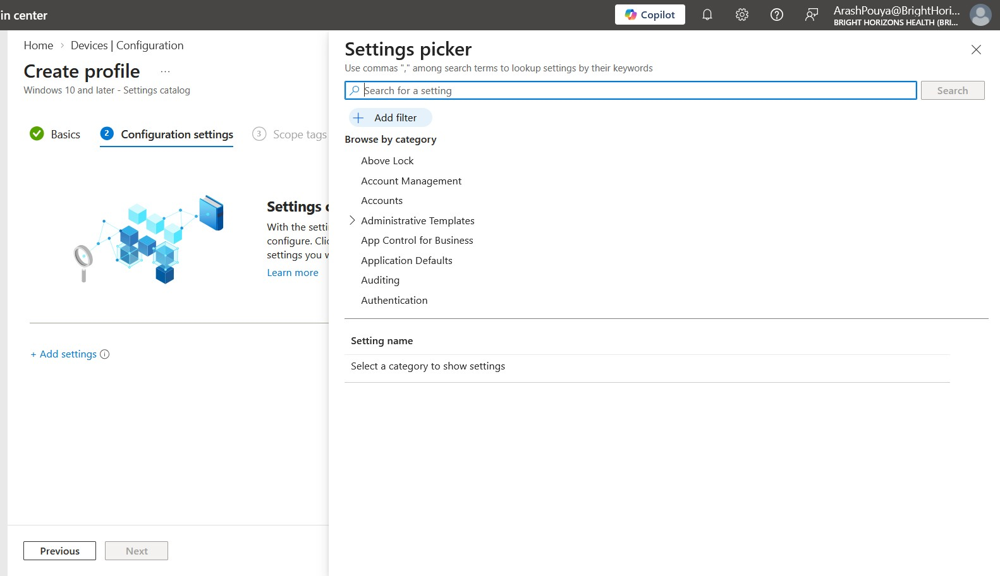
</p>

The initial policy was named:

`Windows-Personalization-Pilot`

<p align="center">
  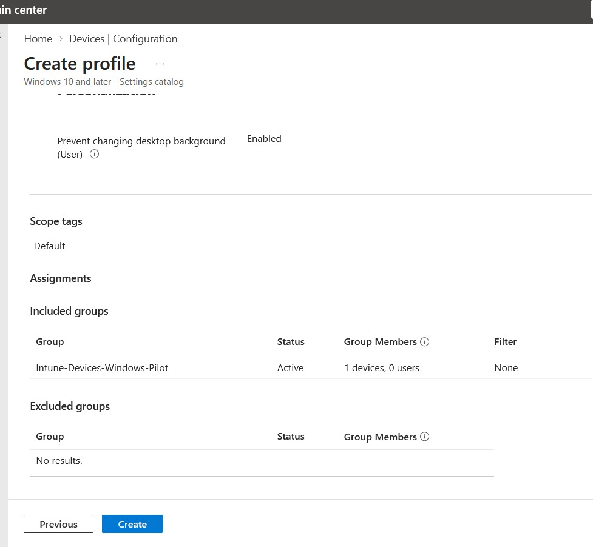
</p>

---

# 2. Pilot Device Group Validation

Before using the policy as a meaningful device-targeting test, the pilot device group was reviewed.

The group contained the intended Windows pilot endpoint, allowing later tests to distinguish between **device assignment** and **user policy context**.

<p align="center">
  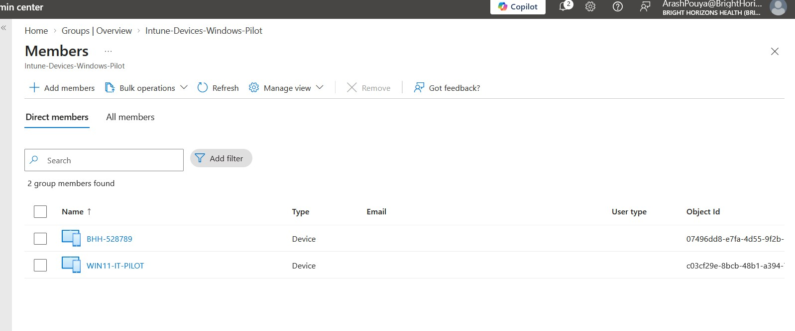
</p>

This reinforced a core design principle used throughout the lab:

> Device-targeted settings should normally follow managed devices, while user-targeted settings should normally follow user identities.

---

# 3. User Context Matters

An early test produced an important result: the policy did not behave as expected while the device was being used with a local account.

After signing in with the Microsoft Entra identity for **Alex Johnson**, Windows displayed the expected managed state and prevented the user from changing the desktop background.

<p align="center">
  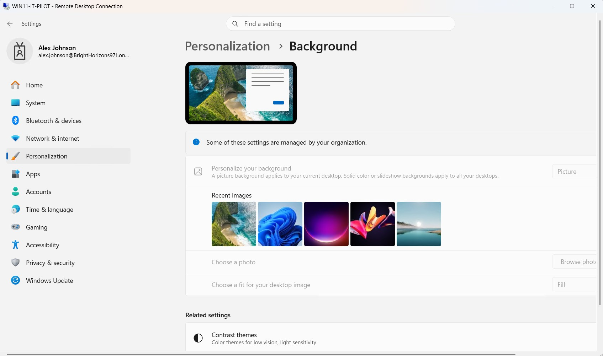
</p>

This demonstrated that the presence of a managed device does not mean every policy applies identically to every session.

### Lesson

A configuration may be:

- assigned through a device or user group,
- processed in device or user context,
- visible in Intune reporting,
- and experienced differently depending on which identity is signed in.

This became one of the most important themes of the project.

---

# 4. Controlled Rollback

Rather than deleting the policy, the assignment was removed.

The policy itself remained available as a lab artefact, while the endpoint was allowed to process the removal.

<p align="center">
  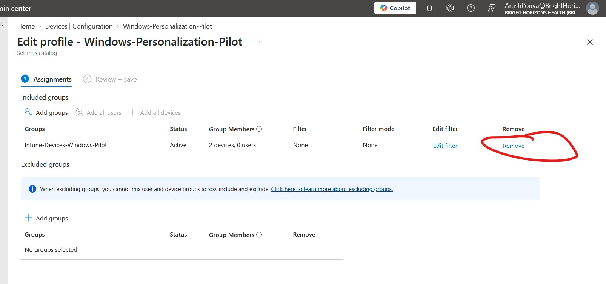
</p>

After synchronisation and session refresh, the user could again change the desktop background.

<p align="center">
  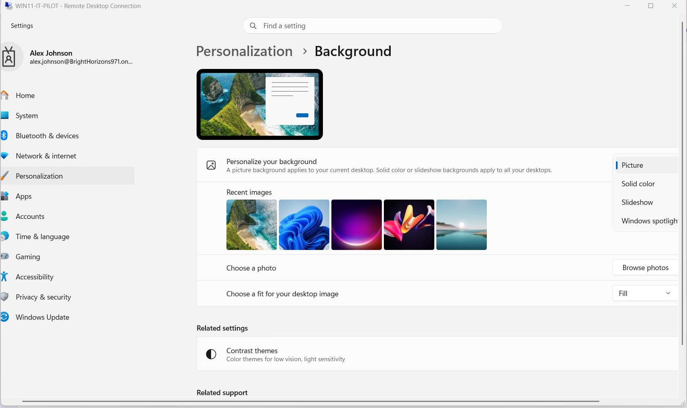
</p>

### Rollback lesson

For a controlled pilot:

> **Unassign and observe before deleting.**

This preserves troubleshooting evidence and makes it easier to understand whether the endpoint correctly removes the managed state.

---

# 5. Building a More Realistic Corporate Windows Profile

The next stage moved beyond a single training setting and created:

`Windows-Corporate-Standard-Pilot`

The profile was designed as a device-oriented pilot baseline for Bright Horizons Health Windows workstations.

The settings tested during the project included:

- Device password / inactivity lock behaviour
- Windows Consumer Features control
- Windows Spotlight dependency behaviour
- Corporate desktop wallpaper

---

## 5.1 Device Lock Testing

A short inactivity period was deliberately used so that device-scoped behaviour could be validated quickly.

<p align="center">
  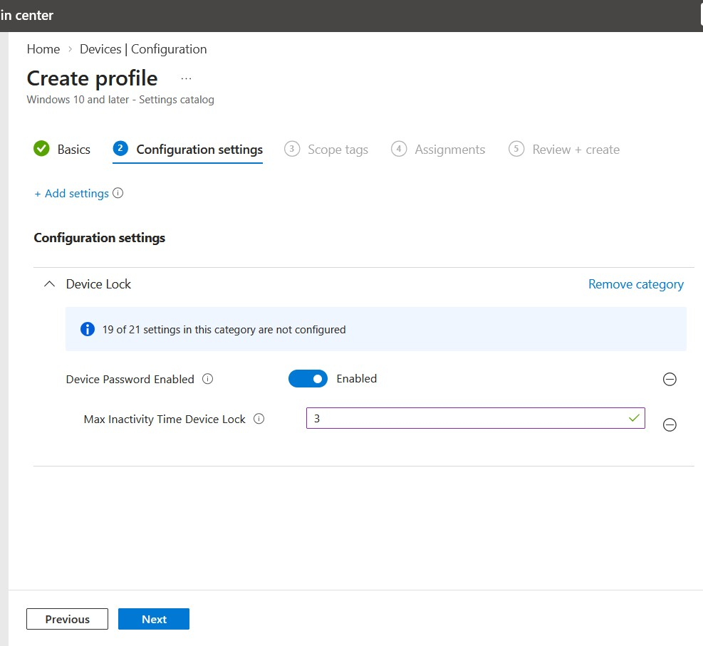
</p>

The lock behaviour was tested with multiple users on the same device. It applied regardless of which user was signed in, demonstrating the practical effect of a **device-scoped** configuration.

After successful validation, the setting was later removed from the final corporate profile because a short lab timeout was not appropriate for ongoing lab usability.

This was an important production-design lesson:

> A setting can be technically successful without belonging in the final production baseline.

---

## 5.2 Windows Consumer Features

The corporate profile also configured:

**Allow Windows Consumer Features = Block**

The Settings Catalog exposed **Allow Windows Spotlight (User)** alongside this configuration, so the relationship between settings was retained rather than removing a required supporting configuration without understanding its impact.

<p align="center">
  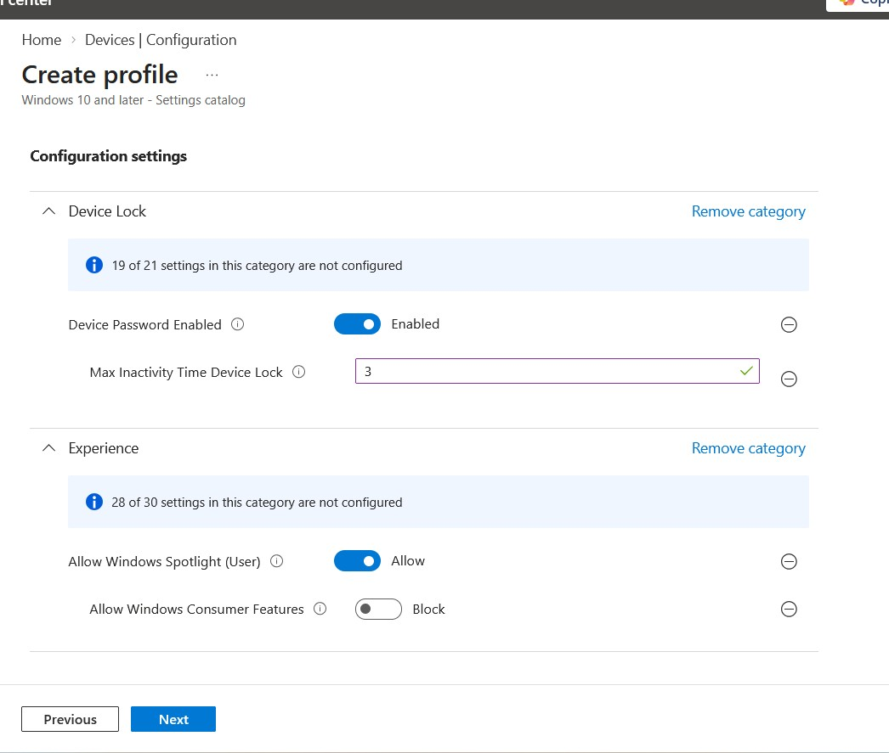
</p>

This setting was validated primarily through Intune management state rather than attempting to manufacture an artificial visual test for a feature whose effect is not always immediate.

---

# 6. Corporate Wallpaper Deployment

Bright Horizons Health corporate branding was added using the Settings Catalog **Desktop Image URL** setting.

The image was hosted on the Bright Horizons lab website and independently tested in a browser before being used as a policy dependency.

The policy successfully processed in Intune, but the existing Windows session did not immediately update the visible desktop.

After sign-out and sign-in, the corporate wallpaper appeared.

<p align="center">
  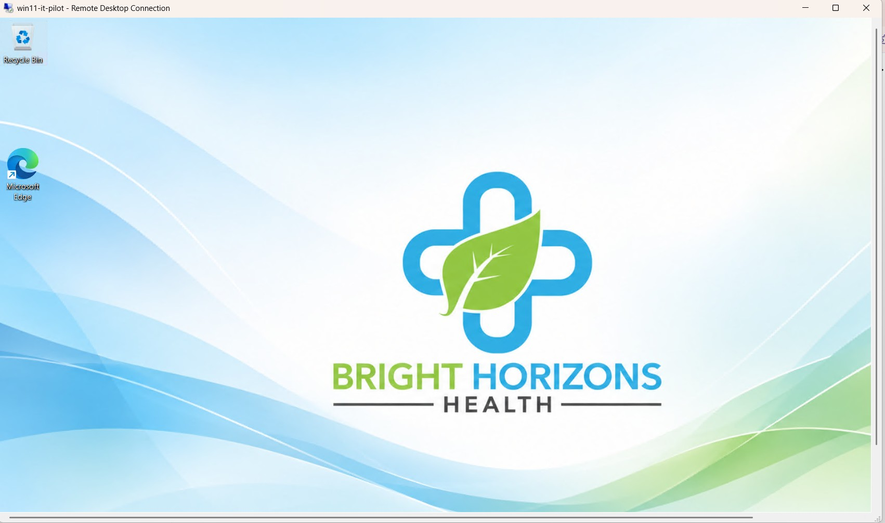
</p>

### Important lesson

> **Intune reports policy processing; it does not guarantee that every visible Windows shell element refreshes immediately.**

For some user-experience settings, a sign-out/sign-in or other session refresh may be required.

### Production consideration

The lab used a web-hosted image because the objective was to learn policy configuration and deployment. A production design should also consider:

- HTTPS hosting
- content availability
- local/offline availability
- asset ownership and change control
- endpoint caching or local delivery where appropriate

---

# 7. Setting-Level Reporting

The corporate profile successfully reported against the pilot device.

<p align="center">
  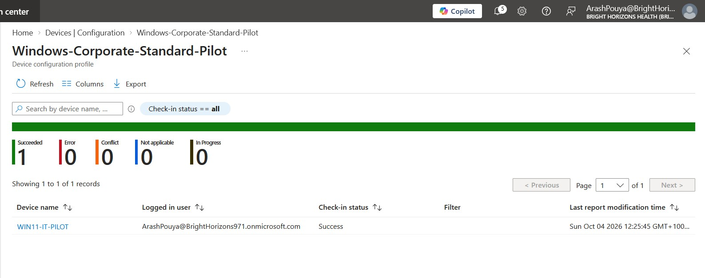
</p>

The setting-level report was then used to validate individual configuration items rather than relying only on the profile-level status.

<p align="center">
  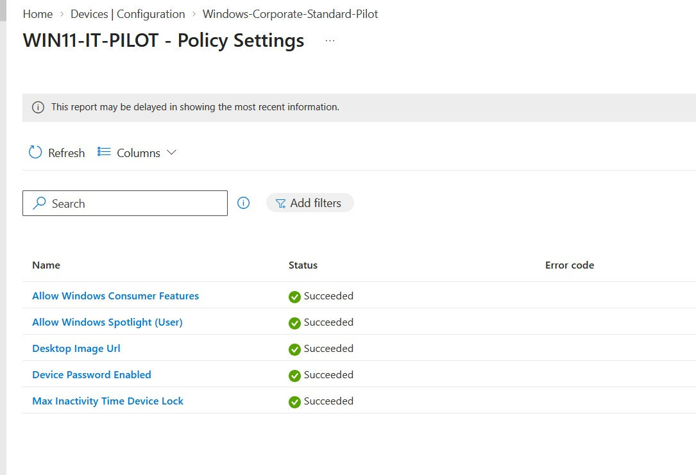
</p>

This established an important troubleshooting habit:

> Profile-level status is useful, but setting-level status is often more useful when diagnosing a configuration problem.

---

# 8. Creating a User-Targeted Restriction Policy

A separate policy was created for a genuine **user-context** experiment:

`Windows-User-Restrictions-Pilot`

The configured setting was:

**Administrative Templates → System → Ctrl Alt Del Options → Remove Task Manager (User) = Enabled**

<p align="center">
  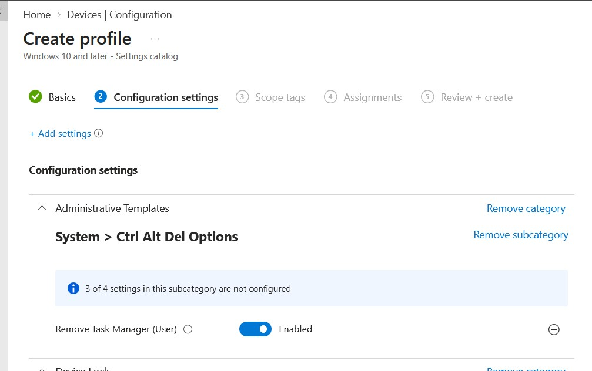
</p>

The policy was assigned to:

`Intune-Users-Pilot`

<p align="center">
  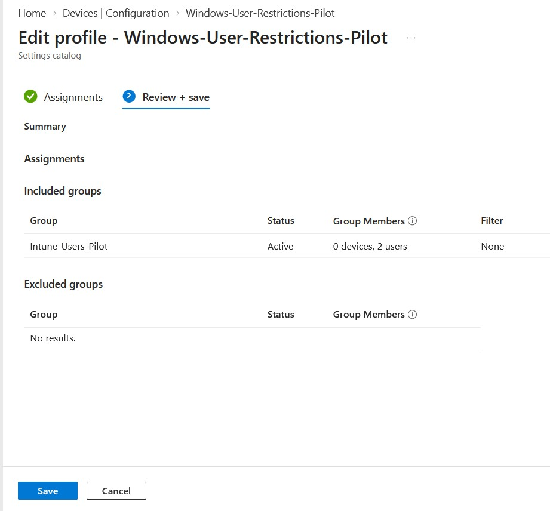
</p>

---

# 9. Same Device, Different User

This became one of the clearest demonstrations in the project.

On the same physical Windows endpoint:

- **Alex Johnson**, a targeted pilot user, was prevented from using Task Manager.
- **Arash Pouya**, who was not targeted by the user policy, could open Task Manager normally.

<p align="center">
  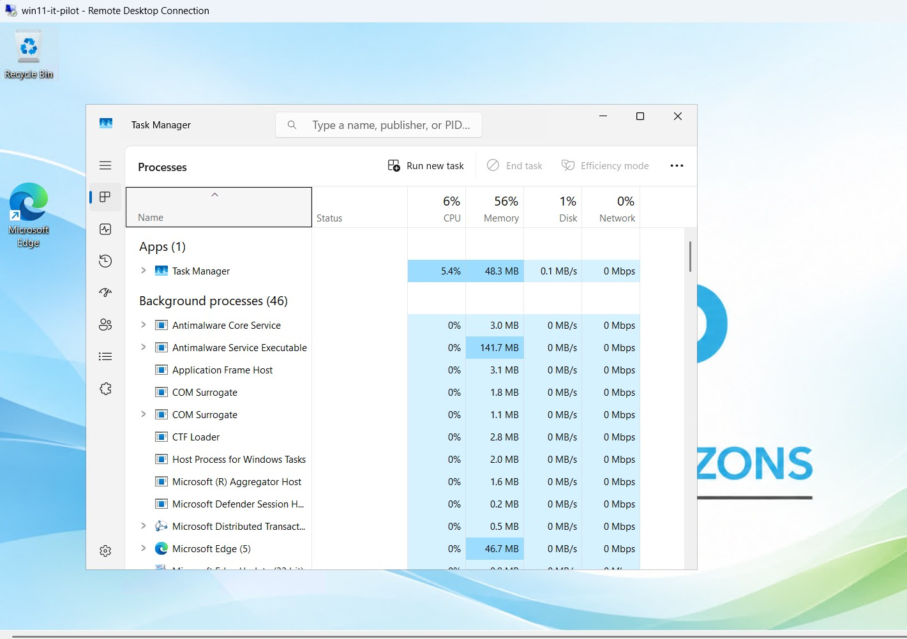
</p>

At the same time, device-targeted settings such as the corporate wallpaper continued to follow the machine.

### Result

This gave a practical demonstration of the difference between:

**Device-targeted configuration follows the managed endpoint.**

**User-targeted configuration follows the signed-in identity.**

---

# 10. Deliberately Creating a Policy Conflict

To understand how Intune behaves when two configuration profiles request incompatible values for the same setting, a temporary profile was created:

`Windows-Conflict-Test-Pilot`

It configured the same setting as the user restriction profile, but with the opposite value:

**Remove Task Manager (User) = Disabled**

<p align="center">
  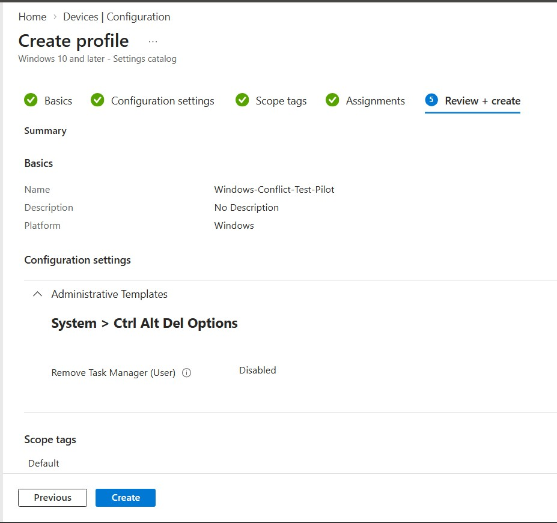
</p>

The temporary policy was assigned to the same pilot user group.

Intune subsequently reported the setting as:

**Conflict**

<p align="center">
  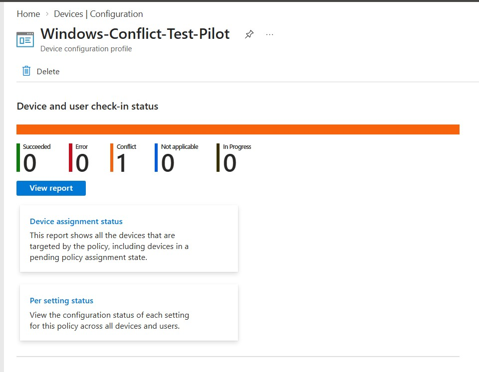
</p>

The test intentionally avoided assuming which value should "win".

The endpoint was then investigated independently.

---

# 11. Endpoint Behaviour During the Conflict

While Intune reported a conflict, Alex Johnson still could not open Task Manager.

That observation alone was not treated as proof of a universal Intune precedence rule.

Instead, the investigation asked three separate questions:

1. What does the Intune management plane report?
2. What policy state does Windows show locally?
3. What does the user actually experience?

This distinction became central to the troubleshooting approach used in the project.

---

# 12. MDM Diagnostic Report

The Windows **MDM Diagnostic Report** was generated from the managed endpoint.

The report confirmed:

- the device was managed by Bright Horizons Health,
- the latest MDM synchronisation had succeeded,
- the active account was the Microsoft Entra user,
- the user token had succeeded,
- and managed policy state was visible locally.

<p align="center">
  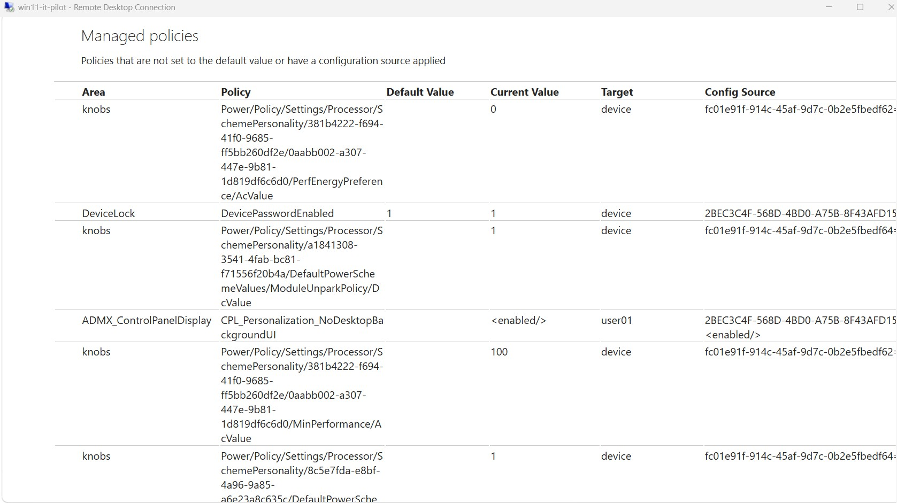
</p>

The report exposed management information using fields such as:

- Area
- Policy
- Current Value
- Target
- Config Source

This makes the MDM Diagnostic Report one of the closest Windows-side tools to a **resulting management state** view for Intune-managed policy.

---

# 13. Searching the MDM Report with PowerShell

The HTML report was difficult to search efficiently in the browser, so PowerShell was used to search the raw report.

`Select-String` was first used to locate the Task Manager policy name.

<p align="center">
  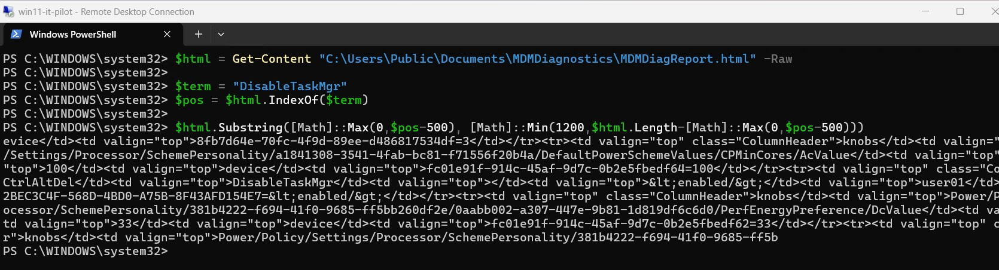
</p>

Because much of the HTML table was stored on a single long line, the report was then read as a raw string and a smaller section around `DisableTaskMgr` was extracted.

The resulting endpoint evidence showed that the effective managed policy state still contained:

`DisableTaskMgr = <enabled/>`

for the user context.

### Troubleshooting lesson

When a large HTML, XML or log file is difficult to inspect visually:

> Use PowerShell to search the underlying text and narrow the output to the relevant setting, CSP name, error code or timestamp.

---

# 14. MDM Event Viewer Investigation

The primary Windows MDM event log used in this exercise was:

`Applications and Services Logs → Microsoft → Windows → DeviceManagement-Enterprise-Diagnostics-Provider → Admin`

The investigation reinforced an important rule:

> A red MDM event near the time of a problem is not automatically related to the problem.

The CSP URI and message contents must be read before deciding whether an event is relevant.

A Task Manager-related Event 454 was found for:

`./User/Vendor/MSFT/Policy/Config/ADMX_CtrlAltDel/DisableTaskMgr`

<p align="center">
  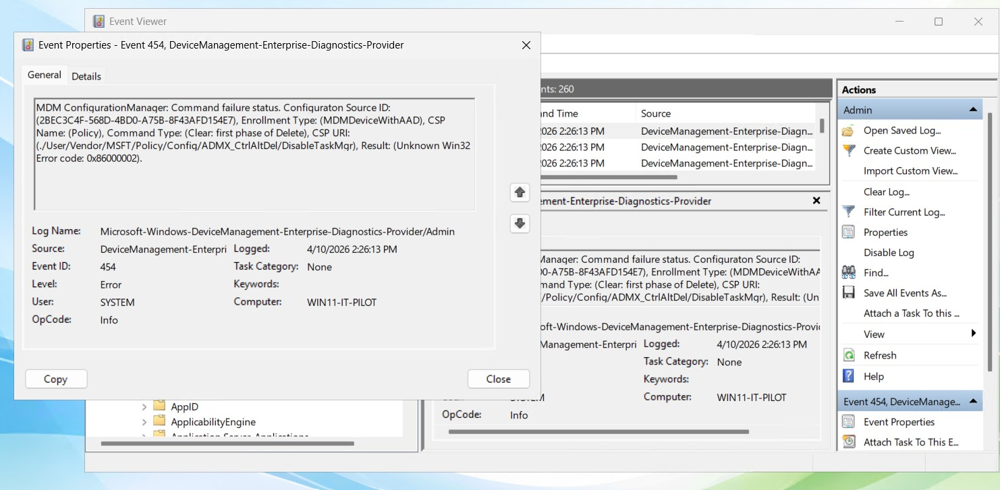
</p>

The event represented a failed **Clear/Delete** operation from an earlier policy change. Its timestamp showed that it was not evidence of the newly created conflict.

This prevented an incorrect troubleshooting conclusion based only on the event severity.

---

# 15. Querying MDM Events with Get-WinEvent

Instead of manually opening events one-by-one, PowerShell was used to query the MDM Admin event log for messages containing `DisableTaskMgr`.

The approach used:

```powershell
Get-WinEvent -LogName "Microsoft-Windows-DeviceManagement-Enterprise-Diagnostics-Provider/Admin" |
    Where-Object { $_.Message -match "DisableTaskMgr" } |
    Select-Object TimeCreated, Id, LevelDisplayName, Message |
    Format-List
```

<p align="center">
  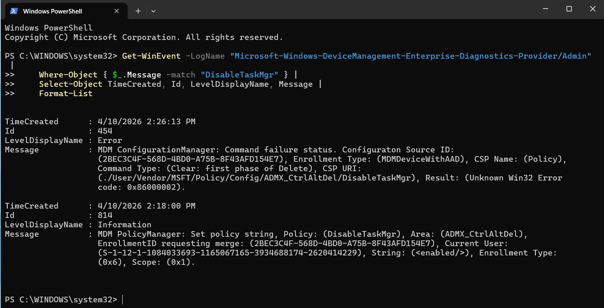
</p>

The output showed two particularly useful historical events:

### Event 814

An informational event showed the policy being set with:

`String: (<enabled/>)`

for the user context.

This was strong evidence that Windows had previously processed the original `DisableTaskMgr` policy successfully.

### Event 454

A later event showed a failed clear/delete operation against the same CSP URI.

No new `DisableTaskMgr` event was found for the newly created conflict at that point.

### Resulting interpretation

The evidence supported the following careful conclusion:

> The original `DisableTaskMgr = Enabled` state remained effective on the endpoint while Intune reported contradictory desired configurations as a conflict.

The exercise did **not** establish a universal rule that "the most restrictive Intune policy always wins".

---

# 16. Resolving the Conflict

The temporary `Windows-Conflict-Test-Pilot` assignment was removed.

The original `Windows-User-Restrictions-Pilot` policy remained assigned long enough to observe recovery.

After policy processing, the setting returned from:

**Conflict → Succeeded**

<p align="center">
  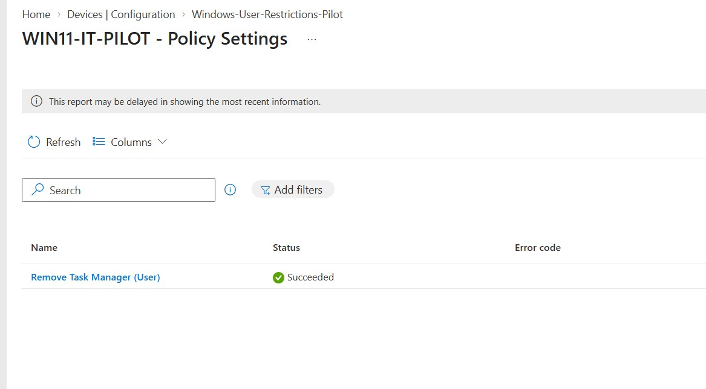
</p>

This completed the full conflict lifecycle:

**Known-good baseline → Introduce conflict → Reproduce → Investigate → Remove conflicting assignment → Validate recovery**

---

# 17. Production Review and Final Cleanup

After completing the technical exercises, the profiles were reviewed from a production perspective.

This was important because:

> A setting that works technically is not automatically a setting that belongs in production.

### `Windows-Corporate-Standard-Pilot`

Retained as the active pilot profile for legitimate corporate configuration.

The short inactivity/device-lock configuration used for testing was removed from the final profile because it had served its lab purpose.

The corporate wallpaper and consumer-experience configuration remained part of the pilot configuration.

### `Windows-User-Restrictions-Pilot`

The Task Manager restriction was useful for learning user-targeted policy behaviour, but it did not have a strong enough business requirement to remain as a normal BHH production restriction.

The policy was therefore unassigned after testing.

Task Manager availability was validated again after rollback.

### `Windows-Conflict-Test-Pilot`

The conflict-test profile was unassigned and retained only as a lab/troubleshooting artefact.

### `Windows-Personalization-Pilot`

The original learning policy remained unassigned and retained as evidence of the early Settings Catalog and rollback exercise.

---

# 18. Final Project State

The final Project 03 state was:

| Policy | Final status | Purpose |
|---|---|---|
| `Windows-Corporate-Standard-Pilot` | Active pilot assignment | Legitimate corporate device configuration |
| `Windows-User-Restrictions-Pilot` | Unassigned | User-targeting and Task Manager lab evidence |
| `Windows-Conflict-Test-Pilot` | Unassigned | Deliberate conflict troubleshooting evidence |
| `Windows-Personalization-Pilot` | Unassigned | Initial Settings Catalog and rollback evidence |

<p align="center">
  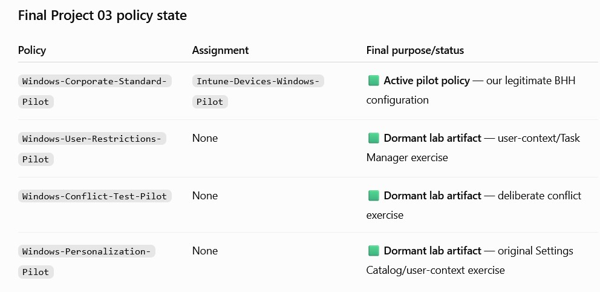
</p>

---

# 19. Related Systems Administration Troubleshooting

Several useful Windows administration lessons arose while validating the Intune lab.

These were not the primary objective of Project 03, but they strengthened the endpoint troubleshooting workflow.

## Windows Firewall and Routed Subnets

The pilot VM could communicate outbound, but another internal subnet could not initially ping the VM.

The Windows Firewall ICMP rule was enabled, but its **Remote IP scope** was restricted to **Local subnet**.

Because the source system was on another routed subnet, the rule did not match.

The rule was narrowed to the required source subnet rather than opening it to `Any`.

<p align="center">
  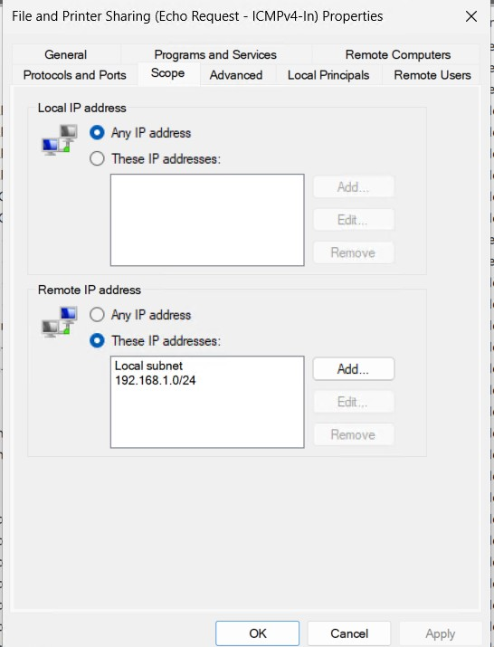
</p>

### Lesson

When troubleshooting firewall behaviour, do not stop at:

- rule enabled,
- firewall profile,
- protocol.

Also inspect:

- **scope**
- source subnet
- destination
- local versus routed network definition

A one-way ping problem can be a host firewall scope issue rather than a routing failure.

---

# 20. Licensing Interruption and Recovery

During the project, Intune portal access was interrupted by licensing state.

A Microsoft 365 Business Premium licence was assigned to restore Intune functionality.

An initial group-based licensing attempt exposed a mutually exclusive service-plan conflict caused by an older Microsoft 365 E3 assignment.

<p align="center">
  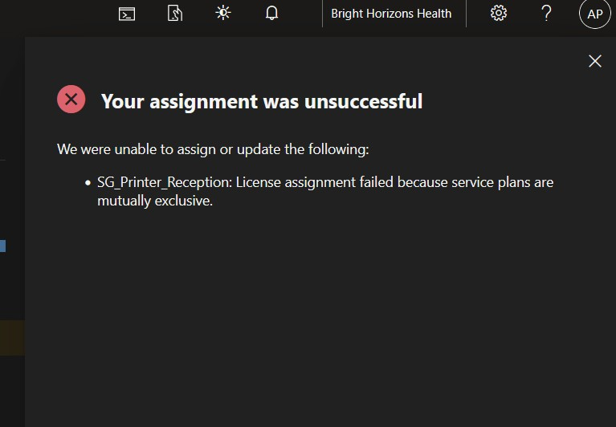
</p>

After the conflicting licence assignment was removed, Business Premium assignment completed successfully and Intune access was restored.

<p align="center">
  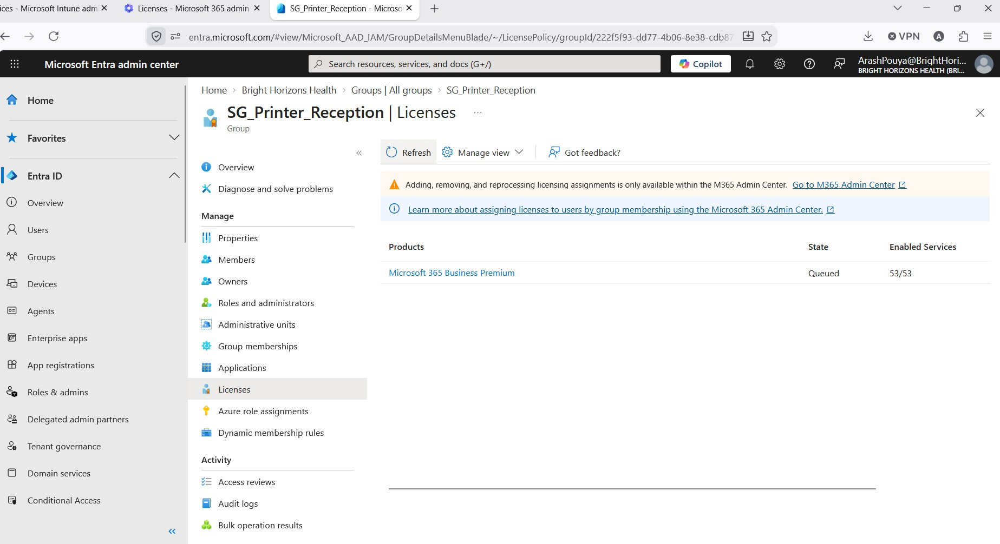
</p>

### Lesson

When Intune becomes unexpectedly unavailable:

> Check licensing and service-plan assignment before assuming the issue is RBAC, portal corruption or device configuration.

---

# Troubleshooting Method Developed During Project 03

The project produced a reusable troubleshooting sequence for Windows configuration policy:

```text
1. Confirm intended policy and business requirement
        ↓
2. Confirm assignment and target group
        ↓
3. Confirm user versus device context
        ↓
4. Trigger/confirm MDM sync
        ↓
5. Check profile-level status
        ↓
6. Check setting-level status
        ↓
7. Reproduce the behaviour on the endpoint
        ↓
8. Generate the MDM Diagnostic Report
        ↓
9. Inspect the effective managed policy state
        ↓
10. Check DeviceManagement-Enterprise-Diagnostics-Provider/Admin
        ↓
11. Filter events by policy/CSP/error/time using Get-WinEvent
        ↓
12. Resolve the assignment/configuration problem
        ↓
13. Sync again and validate recovery
```

The key principle was:

> **Correlate portal state, endpoint policy state and actual user experience rather than assuming any one view tells the whole story.**

---

# Key Lessons Learned

## 1. Configuration Profile and Settings Catalog Are Different Concepts

A **configuration profile** is the policy object.

The **Settings Catalog** is one method used to select and configure Windows settings inside that policy.

---

## 2. User and Device Context Must Be Understood

A managed device does not mean every configuration applies identically to every user.

This project demonstrated both:

- settings that followed the device,
- and settings that followed the signed-in identity.

---

## 3. Assignment Is Not the Same as Application

Assignment tells Intune who should receive a policy.

Endpoint validation is still required to determine what Windows actually processed and what the user experiences.

---

## 4. MDM Sync Is Not Identical to `gpupdate /force`

Manual MDM Sync can request policy processing, but it does not force every Intune backend assignment, evaluation or reporting process to complete immediately.

Repeatedly clicking Sync is therefore not a substitute for understanding the full management path.

---

## 5. Reporting Can Lag Behind Endpoint Reality

The project observed situations where:

- the endpoint had already changed,
- the Intune portal still displayed older timestamps,
- or a visible Windows shell change required session refresh.

Portal reporting, endpoint policy state and user experience should be correlated.

---

## 6. Policy Conflict Should Be Investigated, Not Guessed

Two Settings Catalog profiles deliberately configured opposite values for the same user setting.

Intune correctly reported a **Conflict**.

The endpoint's existing restriction remained effective, but this was not treated as proof of a universal "more restrictive wins" rule.

---

## 7. CSP Paths Help Connect Intune to Windows

The friendly Intune setting:

**Remove Task Manager (User)**

mapped to the Windows MDM policy path:

`./User/Vendor/MSFT/Policy/Config/ADMX_CtrlAltDel/DisableTaskMgr`

Understanding that relationship made the MDM Diagnostic Report and Event Viewer much more useful.

---

## 8. Event IDs Are Not Enough by Themselves

An Event 454 can represent an MDM command failure, but the event must still be interpreted using:

- timestamp,
- CSP URI,
- command type,
- result/error code,
- configuration source.

A red event near a sync does not automatically explain the problem being investigated.

---

## 9. PowerShell Is a Troubleshooting Multiplier

`Select-String` and `Get-WinEvent` made it possible to search large diagnostic data sets quickly instead of manually clicking through reports and events.

The important skill is not memorising every command.

It is knowing:

> **what question to ask, where the evidence lives, and how to filter it.**

---

## 10. Technical Success Does Not Equal Production Suitability

The Task Manager restriction and aggressive inactivity timeout both worked.

Neither automatically belonged in the final BHH production-style configuration.

Production policy should start with a business or security requirement, not with a setting that happens to be available in Intune.

---

# Skills Demonstrated

This project provided hands-on experience with:

- Microsoft Intune configuration profiles
- Windows Settings Catalog
- Pilot deployment methodology
- User and device targeting
- Policy assignment and removal
- MDM synchronisation
- Setting-level reporting
- Endpoint validation
- Controlled rollback
- Corporate Windows configuration
- User-context ADMX policy
- Device-context configuration
- Intune policy conflict investigation
- MDM Diagnostic Report
- Windows MDM CSP paths
- DeviceManagement-Enterprise-Diagnostics-Provider logs
- Event Viewer troubleshooting
- PowerShell `Select-String`
- PowerShell `Get-WinEvent`
- Policy remediation and recovery validation
- Windows Firewall scope troubleshooting
- Microsoft 365 / Intune licensing troubleshooting
- Production policy review

---

# Interview Talking Point

A useful example from this project is the deliberate Task Manager policy conflict:

> I created two Intune Settings Catalog profiles that targeted the same user setting with opposite values. Intune reported the setting as Conflict. Rather than relying only on the portal, I reproduced the behaviour on the Windows endpoint, generated the MDM Diagnostic Report, confirmed the effective `DisableTaskMgr` state, and queried the DeviceManagement Enterprise Diagnostics event log with PowerShell. I then removed the conflicting assignment, synchronised the endpoint and confirmed the setting returned to Succeeded. The exercise reinforced the importance of correlating Intune reporting, Windows policy state and actual user experience.

---

# Project Outcome

Project 03 moved beyond learning where configuration settings are located in the Intune portal.

By the end of the project I had practised the complete lifecycle of a Windows configuration policy:

**Design → Configure → Assign → Sync → Validate → Troubleshoot → Roll back → Review for production**

It also established the foundation for a broader **Intune & Windows Endpoint Troubleshooting Field Manual**, where the diagnostic tools encountered throughout the lab can be organised by:

**When would I use this? → Where do I look? → What evidence am I looking for? → What did the lab demonstrate?**

The pilot Windows endpoint is now ready for the next Intune lab project.
